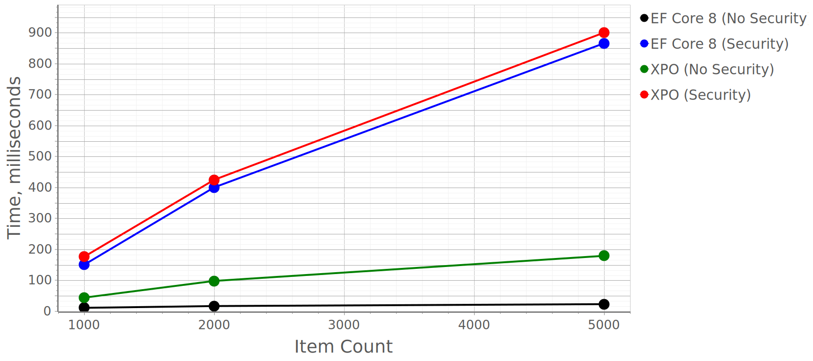
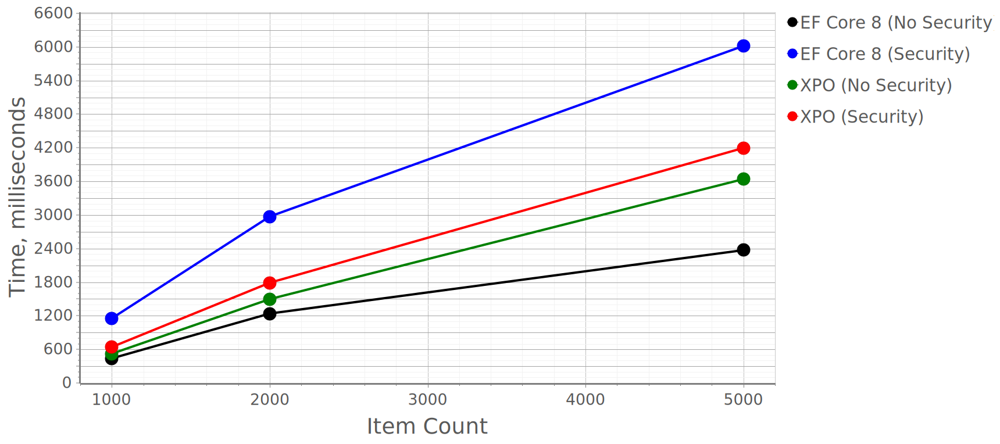
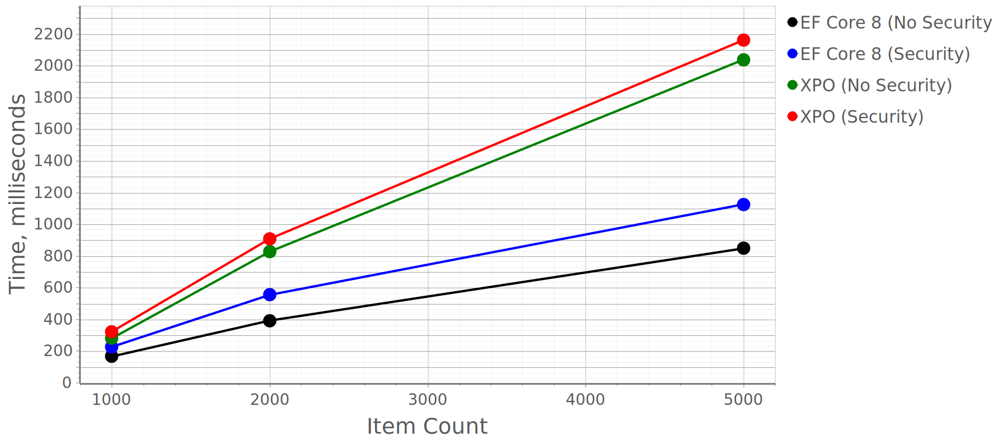
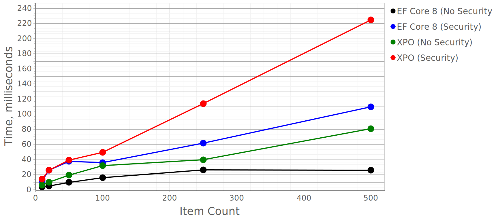
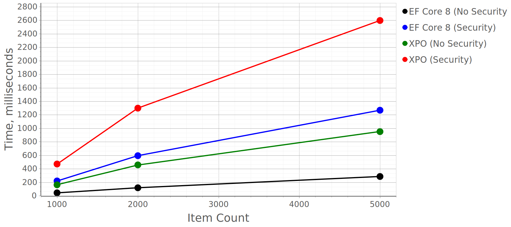

# .NET App Security API Benchmark for EF Core and XPO 

## About the Project

We built this project to test the performance of Object-Relational Mapping (ORM) libraries used with [XAF's Security System](https://www.devexpress.com/products/net/application_framework/security.xml). We tested two libraries with [BenchmarkDotNet](https://github.com/dotnet/BenchmarkDotNet):

 - [Microsoft Entity Framework Core](https://docs.microsoft.com/en-us/ef/core/) (EF Core)
 - [DevExpress eXpress Persistent Objects™](https://www.devexpress.com/Products/NET/ORM/) (XPO)
 
You can run the benchmarks on your computer or review our test results below.

## Run Benchmarks in Your Environment

You can download the project and run the benchmarks on a system different from the one listed in our Test Results section. You can also modify the data model and test cases: measure memory consumption, include scenarios with BLOBs, add reference or collection properties, and so on. 

Once you download the project, follow the steps below to run benchmark tests in your environment:

1. Download and run the [DevExpress Unified Component Installer](https://www.devexpress.com/Products/Try/) to add [DevExpress.Xpo](https://www.nuget.org/packages/DevExpress.Xpo/) and other libraries to project references.
2. Edit the connection string in [App.config](../Benchmarks/XAFSecurityBenchmark/XAFSecurityBenchmark/App.config).
3. Update the ORM library and target framework versions, if necessary.

## Get Support
Contact us if you cannot compile or run any of these demo apps or have questions about our tutorials or supported functionality. Submit questions to the DevExpress [Support Center](https://www.devexpress.com/ask) or switch to [the Issues tab above](https://github.com/DevExpress-Examples/XAF_how-to-use-the-integrated-mode-of-the-security-system-in-non-xaf-applications-e4908/issues). We are here to help.

## Benchmark Configuration
### Data Model Structure
This project uses the following business objects:

<p float="left">
   
</p>

### Users and Permissions

Our project creates and loads data objects according to the following data access rules:

1. A user can access a Contact if their Departments match.
2. A user can access a Task in two cases: a user from the same department is specified in the AssignedTo field, or such a user exists in the task's Contacts collection.

We use the following code to implement these rules.

#### In Apps without the Security System

```csharp
    Expression<Func<Contact, bool>> ContactsFilterPredicate(ICustomPermissionPolicyUser currentUser) =>
        contact => contact.Department == currentUser.Department;

    Expression<Func<DemoTask, bool>> TasksFilterPredicate(ICustomPermissionPolicyUser currentUser) =>
        task => task.Contacts.Any(contact => contact.Department.Users.Any(user => user == currentUser)) ||
        ((Contact)task.AssignedTo).Department == currentUser.Department;
```

We use these filter predicates to load objects in security-free XPO and EF Core tests. This way we obtain the numbers that we compare to tests with integrated Security System. 

#### In Apps with the Security System

```csharp
    userRole.AddTypePermission<ContactType>(SecurityOperations.FullObjectAccess, SecurityPermissionState.Deny);
    userRole.AddObjectPermission<ContactType>(SecurityOperations.FullObjectAccess,
      $"[Department].[Users][[{keyPropertyName}] == CurrentUserId()].Exists()", SecurityPermissionState.Allow);

    userRole.AddTypePermission<TaskType>(SecurityOperations.FullObjectAccess, SecurityPermissionState.Deny);
    userRole.AddObjectPermission<TaskType>(SecurityOperations.FullObjectAccess,
      $"[Contacts][[Department].[Users][[{keyPropertyName}] == CurrentUserId()].Exists()]", SecurityPermissionState.Allow);

    if(typeof(TaskType).IsSubclassOf(typeof(DevExpress.Persistent.BaseImpl.Task))
        || typeof(TaskType).IsSubclassOf(typeof(XAFSecurityBenchmark.Models.EFCore.Task))) {
        userRole.AddObjectPermission<TaskType>(SecurityOperations.FullObjectAccess,
          $"[AssignedTo].<Contact>[Department].[Users][[{keyPropertyName}] == CurrentUserId()].Exists()", SecurityPermissionState.Allow);
    }
    else {
        userRole.AddObjectPermission<TaskType>(SecurityOperations.FullObjectAccess,
          "Upcast(AssignedTo, 'XAFSecurityBenchmark.Models.EFCore.Contact', 'Department') == CurrentUserDepartment()", SecurityPermissionState.Allow);
    }
```
 **Source:** [DBUpdaterBase.CreateSecurityObjects](../Benchmarks/XAFSecurityBenchmark/XAFSecurityBenchmark/PerformanceTests/Base/DBUpdater/DBUpdaterBase.cs#L114-131)

### Initial Data

1) Tests that create new objects start with an empty database. The code cleans the database after every test iteration cycle.
2) Tests that load collections and modify data use the following prepared dataset: 
     - The database updater creates five test users specified by the [TestSetConfig.Users](../Benchmarks/XAFSecurityBenchmark/XAFSecurityBenchmark/PerformanceTests/Base/TestSetConfig.cs#L20) array.
     - For every User, we generate 5,000 Contacts (a grand total of 25,000 Contacts in the database). The tests read varying number of contacts on each test iteration (see graphs below). The [TestSetConfig.ContactCountPerUserToCreate](../Benchmarks/XAFSecurityBenchmark/XAFSecurityBenchmark/PerformanceTests/Base/TestSetConfig.cs#L21) array specifies the numbers for each test run.
     - For every Contact, we generate Tasks. The [TestSetConfig.TasksAssignedToContact](../Benchmarks/XAFSecurityBenchmark/XAFSecurityBenchmark/PerformanceTests/Base/TestSetConfig.cs#L22) and [TestSetConfig.TasksLinkedToContact](../Benchmarks/XAFSecurityBenchmark/XAFSecurityBenchmark/PerformanceTests/Base/TestSetConfig.cs#L23) specify the number of Tasks assigned to and linked to the Contact, respectively. The database holds a grand total of 500,000 Tasks.
    - For every Contact, we initialize its associated data such as PhoneNumber, Position and Address.

For more information, see the test object creation logic in the [TemporaryTestObjectsHelper](../Benchmarks/XAFSecurityBenchmark/XAFSecurityBenchmark/PerformanceTests/Base/DBUpdater/TempDataCreationHelpers/TemporaryTestObjectsHelper.cs) class.


## Test Results

We ran all benchmarks against .NET 7 and used AnyCPU release builds (include warm-up). The test machine had Windows 10 Enterprise x64, local Microsoft SQL Server Express (64-bit) v15.00.4153, i7-8565U CPU 1.80GHz / 16GB RAM / SSD. 

Needless to say, lower numbers are better.

### Scenario #1. Load Contacts for a specific User

<p float="left">
   
  
</p>

|Item Count                    |EF Core 7 (No Security), ms   |EF Core 7 (Security), ms      |XPO (No Security), ms         |XPO (Security), ms            |
|------------------------------|------------------------------|------------------------------|------------------------------|------------------------------|
|10                            |2.137                         |15.555                        |3.544                         |11.355                        |
|20                            |2.372                         |18.684                        |4.716                         |16.017                        |
|50                            |2.958                         |29.913                        |6.143                         |28.360                        |
|100                           |4.045                         |51.640                        |8.766                         |46.192                        |
|250                           |4.391                         |104.730                       |17.527                        |106.108                       |
|500                           |6.594                         |192.740                       |30.370                        |198.772                       |
|1000                          |12.107                        |383.079                       |62.640                        |412.211                       |
|2500                          |26.094                        |988.929                       |173.658                       |997.876                       |
|5000                          |50.671                        |2083.993                      |315.463                       |2033.247                      |

**Source:** [XAFSecurityBenchmark.PerformanceTests.PerformanceTestSet.GetContacts](../Benchmarks/XAFSecurityBenchmark/XAFSecurityBenchmark/PerformanceTests/Base/PerformanceTestSet.cs#L87-L89)


### Scenario #2. Load Tasks for a specific User

<p float="left">
  
  
   
</p>

|Item Count                    |EF Core 7 (No Security), ms   |EF Core 7 (Security), ms      |XPO (No Security), ms         |XPO (Security), ms            |
|------------------------------|------------------------------|------------------------------|------------------------------|------------------------------|
|10                            |2.495                         |23.187                        |4.972                         |14.920                        |
|20                            |2.884                         |37.519                        |6.511                         |23.924                        |
|50                            |3.487                         |75.275                        |14.453                        |43.226                        |
|100                           |4.467                         |136.313                       |23.142                        |76.679                        |
|250                           |7.596                         |316.885                       |49.875                        |171.762                       |
|500                           |25.247                        |637.237                       |88.413                        |334.983                       |
|1000                          |30.504                        |1248.155                      |202.437                       |693.134                       |
|2500                          |45.306                        |3028.845                      |408.700                       |1642.375                      |
|5000                          |69.117                        |6125.420                      |654.301                       |3052.737                      |


**Source:** [XAFSecurityBenchmark.PerformanceTests.PerformanceTestSet.GetTasks](../Benchmarks/XAFSecurityBenchmark/XAFSecurityBenchmark/PerformanceTests/Base/PerformanceTestSet.cs#L91-L93)


### Scenario #3. Create a Contact and its associated data (20 Tasks, PhoneNumbers, Positions, Addresses)

<p float="left">
  
  
   
</p>

|Item Count                    |EF Core 7 (No Security), ms   |EF Core 7 (Security), ms      |XPO (No Security), ms         |XPO (Security), ms            |
|------------------------------|------------------------------|------------------------------|------------------------------|------------------------------|
|10                            |25.909                        |53.984                        |11.900                        |16.243                        |
|20                            |38.878                        |79.663                        |17.762                        |27.020                        |
|50                            |83.446                        |158.860                       |40.149                        |52.719                        |
|100                           |150.557                       |278.268                       |70.912                        |107.628                       |
|250                           |263.194                       |544.880                       |179.938                       |257.916                       |
|500                           |451.381                       |993.907                       |352.796                       |503.348                       |
|1000                          |886.756                       |1907.550                      |708.193                       |999.362                       |
|2500                          |2368.621                      |5108.396                      |1824.166                      |2636.522                      |
|5000                          |4758.400                      |10278.467                     |3901.755                      |5384.106                      |

**Source:** [XAFSecurityBenchmark.PerformanceTests.PerformanceTestSet.InsertContact](../Benchmarks/XAFSecurityBenchmark/XAFSecurityBenchmark/PerformanceTests/Base/PerformanceTestSet.cs#L75-L77)


### Scenario #4. Create a Contact without associated data

<p float="left">
  
  
   
</p>

|Item Count                    |EF Core 7 (No Security), ms   |EF Core 7 (Security), ms      |XPO (No Security), ms         |XPO (Security), ms            |
|------------------------------|------------------------------|------------------------------|------------------------------|------------------------------|
|10                            |11.098                        |19.623                        |7.469                         |10.470                        |
|20                            |17.581                        |27.319                        |11.054                        |15.235                        |
|50                            |43.906                        |59.810                        |24.015                        |29.621                        |
|100                           |58.414                        |86.207                        |43.053                        |53.922                        |
|250                           |111.036                       |166.136                       |102.973                       |120.727                       |
|500                           |179.864                       |271.761                       |205.441                       |231.215                       |
|1000                          |313.583                       |481.306                       |380.816                       |462.171                       |
|2500                          |741.354                       |1161.426                      |967.603                       |1148.420                      |
|5000                          |1555.584                      |2372.834                      |2228.000                      |2574.607                      |

**Source:** [XAFSecurityBenchmark.PerformanceTests.PerformanceTestSet.InsertEmptyContact](../Benchmarks/XAFSecurityBenchmark/XAFSecurityBenchmark/PerformanceTests/Base/PerformanceTestSet.cs#L71-L73)


### Scenario #5. Load, update, and save Contacts for a specific User

<p float="left">
  
  
   
</p>

|Item Count                    |EF Core 7 (No Security), ms   |EF Core 7 (Security), ms      |XPO (No Security), ms         |XPO (Security), ms            |
|------------------------------|------------------------------|------------------------------|------------------------------|------------------------------|
|10                            |3.576                         |18.532                        |7.009                         |20.942                        |
|20                            |4.733                         |31.860                        |10.394                        |30.687                        |
|50                            |7.329                         |40.269                        |16.794                        |59.786                        |
|100                           |11.804                        |69.059                        |30.185                        |106.720                       |
|250                           |24.122                        |145.994                       |67.032                        |253.474                       |
|500                           |47.282                        |274.230                       |133.337                       |487.353                       |
|1000                          |95.412                        |530.680                       |258.765                       |1039.236                      |
|2500                          |275.351                       |1502.104                      |739.040                       |2674.635                      |
|5000                          |643.918                       |2807.549                      |1389.159                      |5230.641                      |

**Source:** [XAFSecurityBenchmark.PerformanceTests.PerformanceTestSet.UpdateContacts](../Benchmarks/XAFSecurityBenchmark/XAFSecurityBenchmark/PerformanceTests/Base/PerformanceTestSet.cs#L79-L81)


### Scenario #6. Load, update, and save Tasks for a specific User

<p float="left">
  
  
   
</p>

|Item Count                    |EF Core 7 (No Security), ms   |EF Core 7 (Security), ms      |XPO (No Security), ms         |XPO (Security), ms            |
|------------------------------|------------------------------|------------------------------|------------------------------|------------------------------|
|10                            |2.238                         |25.831                        |7.054                         |23.061                        |
|20                            |2.376                         |37.813                        |9.897                         |45.240                        |
|50                            |3.304                         |75.034                        |20.730                        |76.505                        |
|100                           |4.115                         |133.763                       |30.518                        |142.173                       |
|250                           |5.563                         |317.196                       |69.589                        |330.393                       |
|500                           |15.787                        |635.859                       |127.165                       |649.131                       |
|1000                          |20.997                        |1251.739                      |268.135                       |1309.636                      |
|2500                          |39.360                        |3089.241                      |592.571                       |3182.562                      |
|5000                          |71.691                        |6100.491                      |1096.704                      |6055.078                      |

**Source:** [XAFSecurityBenchmark.PerformanceTests.PerformanceTestSet.UpdateTasks](../Benchmarks/XAFSecurityBenchmark/XAFSecurityBenchmark/PerformanceTests/Base/PerformanceTestSet.cs#L83-L85) 
