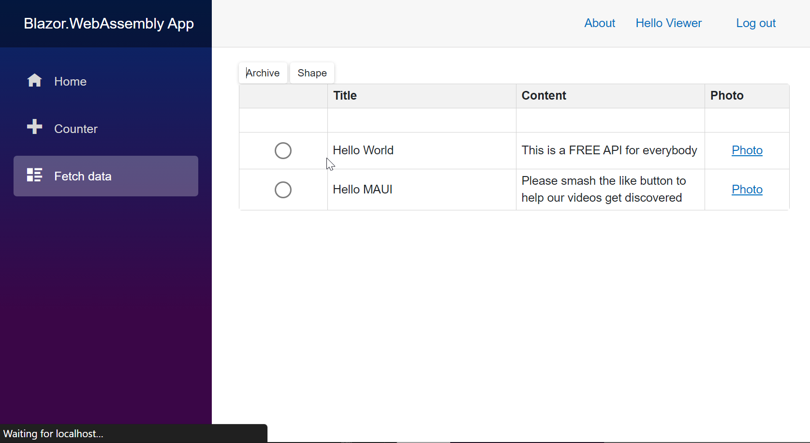

# How to Integrate a Web API Service Backend for a .NET WebAssembly Application

This example demonstrates how you can integrate a [Web API service](https://docs.devexpress.com/eXpressAppFramework/113366/concepts/security-system/security-system-overview) backend and a WebAssembly .NET MAUI application frontend.  The frontend app uses EF Core for data access, to learn how to create the Web API service see [Build and Test a Basic Web API Service App (Backend)](https://github.com/DevExpress-Examples/XAF_Security_E4908/tree/22.2.4%2B/EFCore/MAUI#build-and-test-a-basic-web-api-service-app-backend)

The application works with the same blog post data we used for creating the `Web API Service`. It authenticates a user, determines his or her permissions, and selectively enables the following data operations:

- Authenticates the `Editor` and `Viewer` users using server side (Web API) cookies.
- Lists existing Post records
- Displays a photo of a Post author
- Creates new Post records
- Archives a Post record
- Displays a report based on Post records

## Prerequisites

- [Visual Studio 2022 v17.0+](https://visualstudio.microsoft.com/vs/)
- [.NET SDK 6.0+](https://dotnet.microsoft.com/download/dotnet-core)
- [DevExpress Libraries v22.2+](https://www.devexpress.com/Products/Try/). Download and run our **Unified Component Installer**. Make sure to enable the **Cross-Platform .NET App UI & Web API service (XAF)** option in the list of products to install. The installer will register local NuGet package sources and Visual Studio templates required for this tutorial.

You don't have to use the **DevExpress Unified Component Installer** if you only want to run the example project or use the project as a boilerplate for your application. You can manually register your [NuGet feed URL](https://docs.devexpress.com/GeneralInformation/116042/installation/install-devexpress-controls-using-nuget-packages/obtain-your-nuget-feed-url) in Visual Studio as described in the following article: [Setup Visual Studio's NuGet Package Manager](https://docs.devexpress.com/GeneralInformation/116698/installation/install-devexpress-controls-using-nuget-packages/setup-visual-studios-nuget-package-manager).
  
  > **NOTE**
  >
  > If you’ve used a pre-release version of our components or obtained a hotfix from DevExpress, NuGet packages will not be restored automatically (you will need to update them manually). For more information, please refer to the following article: [Updating Packages](https://docs.devexpress.com/GeneralInformation/118420/Installation/Install-DevExpress-Controls-Using-NuGet-Packages/Updating-Packages). Remember to enable the [Include prerelease](https://docs.microsoft.com/en-us/nuget/create-packages/prerelease-packages#installing-and-updating-pre-release-packages) option.

## [Build and Test a Basic Web API Service App (Backend)](https://github.com/DevExpress-Examples/XAF_Security_E4908/tree/22.2.4%2B/EFCore/MAUI#build-and-test-a-basic-web-api-service-app-backend)

### Configure the Web API service project

1. In Visual Studio, create a new `Blazor.WebAssembly.sln`. Use the Add Existing project menu to add the same Web API service project we used for our MAUI integration.
  
2. Enable cross origin authenticated requests from WebAssembly (CORS) by modifying the `ConfigureServices` method in the WebAPI Startup.cs.

   ```cs
   services.AddCors(options => options.AddPolicy(
            "Open", builder => builder.SetIsOriginAllowed(_ => true).AllowAnyHeader().AllowAnyMethod().AllowCredentials()));
   ```

   similarly modify the `Configure` method:

   ```cs
   app.UseCors("Open");
   ```

3. Configure server side cookie issuance and authorization to maintain security and privacy of user data by modifying the `ConfigureServices` method again.

   ```cs
   var authentication = services.AddAuthentication(customBearerSchemeName);
   authentication.AddCookie(CookieAuthenticationDefaults.AuthenticationScheme); //new line
   ```

   ```cs
   services.AddAuthorization(options => {
            options.DefaultPolicy = new AuthorizationPolicyBuilder(
               CookieAuthenticationDefaults.AuthenticationScheme,//new line
                JwtBearerDefaults.AuthenticationScheme,
                customBearerSchemeName)
                    .RequireAuthenticatedUser()
                    .RequireXafAuthentication()
                    .Build();
        });
   ```

4. Create a `LoginAsync` endpoint in the API/Security/AuthenticationController to login and send the cookie to client (WebAssembly).

   ```cs
    [HttpPost(nameof(LoginAsync))]
    [SwaggerOperation("Checks if the user with the specified logon parameters exists in the database. If it does, authenticates this user.", "Refer to the following help topic for more information on authentication methods in the XAF Security System: <a href='https://docs.devexpress.com/eXpressAppFramework/119064/data-security-and-safety/security-system/authentication'>Authentication</a>.")]
    public async Task<ActionResult> LoginAsync([FromBody] [SwaggerRequestBody(@"For example: <br /> { ""userName"": ""Admin"", ""password"": """" }")]
        AuthenticationStandardLogonParameters logonParameters) {
        try {
            var user=await Task.Run(() => _securityAuthenticationService.Authenticate(logonParameters));
            if (user == null) return Unauthorized("User name or password is incorrect.");
            using var objectSpace = _nonSecuredObjectSpaceFactory.CreateNonSecuredObjectSpace<ApplicationUser>();
            var userOid = new Guid(user.Claims.First(c => c.Type == ClaimTypes.NameIdentifier).Value);
            var xafUser = objectSpace.FirstOrDefault<ApplicationUser>(u => u.ID == userOid);
            (((ClaimsIdentity)user.Identity)!).AddClaims(new[]{new Claim(nameof(ApplicationUser.ID),xafUser.ID.ToString()),new Claim(nameof(ApplicationUser.IsActive),xafUser.IsActive.ToString()), });
            return new SignInResult(CookieAuthenticationDefaults.AuthenticationScheme,
                user, new AuthenticationProperties { AllowRefresh = true, ExpiresUtc = DateTimeOffset.Now.AddDays(1), IsPersistent = true, });
        } catch(AuthenticationException) {
            return Unauthorized("User name or password is incorrect.");
        }
    }
   ```

5. Create a `LogoutAsync` method in the same file, to logout and invalidate the cookie.

   ```cs
    [HttpPost(nameof(LogoutAsync))]
    public async Task<SignOutResult> LogoutAsync() {
        await HttpContext.SignOutAsync(CookieAuthenticationDefaults.AuthenticationScheme);
        return new SignOutResult(CookieAuthenticationDefaults.AuthenticationScheme);
    }
   ```

6. Create an `Authorized` `UserInfo` endpoint to get user info and validate the cookie from the client when needed e.g. page refresh, browser start etc.

   ```cs
    [Authorize][HttpGet(nameof(UserInfo))]
    public ActionResult UserInfo() {
        if (HttpContext.User.Identity?.IsAuthenticated == null || !HttpContext.User.Identity.IsAuthenticated)
            return Unauthorized();
        var claims = ((ClaimsIdentity)HttpContext.User.Identity).Claims.ToArray();
        return Ok(new {
            UserName= HttpContext.User.Identity.Name, 
            ID = claims.First(claim => claim.Type == nameof(ApplicationUser.ID)).Value.ToString(),
            IsActive = claims.First(claim => claim.Type == nameof(ApplicationUser.IsActive)).Value.ToString()
        });
    }
   ```

## Build and Test a WebAssembly project (frontEnd)

### Create a new WebAssembly project and add it to the solution

1. Use either .NET CLI or Visual Studio new project wizard to add a new Blazor WebAssembly to the solution.

   ```cmd
   dotnet new blazorwasm -o Blazor.WebAssembly
   ```

2. Install Required Packages In The Blazor.WebAssembly project using either the package manager or the .NET CLI.

   ```cmd
   dotnet add package Blazored.LocalStorage --version 4.3.0
   dotnet add package Microsoft.AspNetCore.Components.WebAssembly.Authentication --version 7.0.4
   dotnet add package Microsoft.Extensions.Http --version 7.0.0
   dotnet add package Microsoft.AspNetCore.Components.WebAssembly.Authentication --version 7.0.4
   dotnet add package Simple.OData.Client --version 6.0.1
   dotnet add package DevExpress.Blazor --version 22.2.4
   ```

### Register Installed Packages Services

1. Modify the Program.cs.

   ```cs
   builder.Services.AddOptions();
   builder.Services.AddAuthorizationCore();
   builder.Services.AddBlazoredLocalStorage();
   builder.Services.AddDevExpressBlazor(options => {
      options.BootstrapVersion = DevExpress.Blazor.BootstrapVersion.v5;
      options.SizeMode = DevExpress.Blazor.SizeMode.Medium;
   });
   ```

2. Register DevExpress styles in the header of wwwroot/index.html

   ```html
   <link href="_content/DevExpress.Blazor.Themes/blazing-berry.bs5.css" rel="stylesheet" asp-append-version="true" />
   ```

3. Replace the contents of _Imports.razor.

   ```cs
   @using System.Net.Http
   @using System.Net.Http.Json
   @using Microsoft.AspNetCore.Components.Forms
   @using Microsoft.AspNetCore.Components.Routing
   @using Microsoft.AspNetCore.Components.Web
   @using Microsoft.AspNetCore.Components.Web.Virtualization
   @using Microsoft.AspNetCore.Components.WebAssembly.Http
   @using Microsoft.JSInterop
   @using Blazor.WebAssembly
   @using Blazor.WebAssembly.Shared
   @using Microsoft.AspNetCore.Authorization
   @using Microsoft.AspNetCore.Components.Authorization
   @using Blazored.LocalStorage
   @using Microsoft.AspNetCore.Components
   @using Microsoft.AspNetCore.Components.WebAssembly.Authentication
   @using System.Web
   @using DevExpress.Blazor
   @using System.ComponentModel.DataAnnotations
   ```

### Configure the HttpClient

1. Replace the existing `HttpClient` registration with the Web API base address and add a handler to set the browser request credentials.
  
   in Program.cs

   ```cs
   builder.Services.AddHttpClient("API", options => options.BaseAddress = new Uri("https://localhost:5001/api/"))
    .AddHttpMessageHandler<CookieHandler>();
   ```

   in Services folder

   ```cs
   public class CookieHandler : DelegatingHandler {
        protected override async Task<HttpResponseMessage> SendAsync(HttpRequestMessage request, CancellationToken cancellationToken) {
            request.SetBrowserRequestCredentials(BrowserRequestCredentials.Include);
            return await base.SendAsync(request, cancellationToken);
        }
    }
   ```

### Implement and register an AuthenticationStateProvider

1. In Program.cs

   ```cs
   builder.Services.AddScoped<WebAPIAuthenticationStateProvider>();
   builder.Services.AddScoped<AuthenticationStateProvider>(provider => provider.GetRequiredService<WebAPIAuthenticationStateProvider>());
   ```

2. In Services folder

   ```cs
   public class WebAPIAuthenticationStateProvider : AuthenticationStateProvider {
      private ClaimsPrincipal _claimsPrincipal = new(new ClaimsIdentity());
      public override Task<AuthenticationState> GetAuthenticationStateAsync()
         => Task.FromResult<AuthenticationState>(new(_claimsPrincipal));

      public void ClearAuthInfo() {
         _claimsPrincipal = new ClaimsPrincipal(new ClaimsIdentity());
         NotifyAuthenticationStateChanged(GetAuthenticationStateAsync());
      }

      public void SetAuthInfo(UserModel user) {
         _claimsPrincipal = new ClaimsPrincipal(new ClaimsIdentity(new[]{
               new Claim(nameof(UserModel.IsActive), user.IsActive),
               new Claim(nameof(UserModel.ID), user.ID.ToString()),
               new Claim(ClaimTypes.Name, user.UserName),
               new Claim("ID", user.ToString()!) }, "AuthCookie"));
         NotifyAuthenticationStateChanged(GetAuthenticationStateAsync());
      }
   }
   ```

### Create the User and Post models in the Models folder

1. Create a new file Post.cs

   ```cs
   namespace Blazor.WebAssembly.Models;

   public class Post {
      public int PostId { get; set; }
      public string? Title { get; set; }
      public string? Content { get; set; }
   }
   ```

2. Crate a new file UserModel.cs

   ```cs
   namespace Blazor.WebAssembly.Models;

   public class UserModel {
      public Guid ID { get; set; }
      public string UserName { get; set; } = null!;
      public string IsActive { get; set; } = null!;
      
   }
   ```

### Create and register a WebAPI service to call all custom and authentication endpoints of the WebAPI project

1. In Program.cs

   ```cs
   builder.Services.AddScoped<IWebAPI, WebAPI>();
   ```

2. In Services folder

   ```cs
   using System.Net.Http.Json;
   using Blazor.WebAssembly.Models;

   namespace Blazor.WebAssembly.Services;
   public interface IWebAPI {
      Task<HttpResponseMessage> LoginAsync(string? userName,string? password);
      Task<(string message, UserModel? user)> GetUserAsync();
      Task<bool> LogoutAsync();
      Task<bool> CanCreateAsync();
      Task ArchiveAsync(Post post);
      Task<byte[]> GetAuthorPhotoAsync(int postId);
      Task<byte[]> ShapePostsAsync();
   }
   public class WebAPI: IWebAPI {
      private readonly HttpClient _httpClient;

      public WebAPI(IHttpClientFactory httpClientFactory) 
         => _httpClient = httpClientFactory.CreateClient("API");

      public async Task<HttpResponseMessage> LoginAsync(string? userName,string? password) 
         => (await _httpClient.PostAsJsonAsync("Authentication/LoginAsync", new{userName,password}));

      public async Task<(string message, UserModel? user)> GetUserAsync() {
         try {
               var response = await _httpClient.GetAsync("Authentication/UserInfo");
               return response.IsSuccessStatusCode ? ("Success", await response.Content.ReadFromJsonAsync<UserModel>())
                  : response.StatusCode == HttpStatusCode.Unauthorized ? ("Unauthorized", null) : ("Failed", null);
         }
         catch (Exception e) {
               return ("Failed", null);
         }
      }

      public async Task<bool> LogoutAsync() 
         => (await _httpClient.PostAsync("Authentication/LogoutAsync", null)).IsSuccessStatusCode;

      public async Task<bool> CanCreateAsync() 
         => await _httpClient.GetFromJsonAsync<bool>("CustomEndpoint/CanCreate?typename=Post");

      public async Task ArchiveAsync(Post post) 
         => await _httpClient.PostAsJsonAsync("CustomEndPoint/Archive", post);

      public async Task<byte[]> GetAuthorPhotoAsync(int postId) 
         => await _httpClient.GetByteArrayAsync($"CustomEndPoint/AuthorPhoto/{postId}");

      public async Task<byte[]> ShapePostsAsync() 
         => await _httpClient.GetByteArrayAsync("report/DownloadByName(Post Report)");
   }
   ```

3. In wwwroot/index.html header add the next script to save the bytes we receive from the `ShapePostsAsync` method.

   ```js
   <script>
      function saveAsFile(filename, bytesBase64) {
         var link = document.createElement('a');
         link.download = filename;
         link.href = "data:application/octet-stream;base64," + bytesBase64;
         document.body.appendChild(link); // Needed for Firefox
         link.click();
         document.body.removeChild(link);
      }
   </script>
   ```

### [Create and register a GridCustomDataSource to bind a DxGrid (CRUD+Filtering+Sorting) with the build-in OData WebAPI Post Business object endpoint](https://docs.devexpress.com/Blazor/DevExpress.Blazor.GridCustomDataSource)

1. In Program.cs

   ```cs
   builder.Services.AddScoped<SimpleODataClientDataSource>();
   ```

2. In Services folder.

   ```cs
   using System.Collections;
   using Blazor.WebAssembly.Models;
   using DevExpress.Blazor;
   using DevExpress.Data.Filtering;
   using DevExpress.Data.Filtering.Helpers;
   using Simple.OData.Client;

   namespace Blazor.WebAssembly.Services; 

   public class SimpleODataClientDataSource : GridCustomDataSource {
      private readonly ODataClient _client;
      public SimpleODataClientDataSource(IHttpClientFactory httpClientFactory) 
         => _client = new ODataClient(new ODataClientSettings(httpClientFactory.CreateClient("API"),new Uri("odata/", UriKind.Relative)));

      public override async Task<int> GetItemCountAsync(GridCustomDataSourceCountOptions options, CancellationToken cancellationToken) 
         => await ApplyFiltering(options.FilterCriteria, _client.For<Post>()).Count()
               .FindScalarAsync<int>(cancellationToken);

      public override async Task<IList> GetItemsAsync(GridCustomDataSourceItemsOptions options, CancellationToken cancellationToken) {
         var filteredClient = ApplyFiltering(options.FilterCriteria, _client.For<Post>().Top(options.Count).Skip(options.StartIndex));
         return (await ApplySorting(options, filteredClient).FindEntriesAsync(cancellationToken)).ToList();
      }

      private static IBoundClient<Post> ApplyFiltering(CriteriaOperator criteria, IBoundClient<Post> boundClient) 
         => !criteria.ReferenceEqualsNull() ? boundClient.Filter(ToSimpleClientCriteria(criteria)) : boundClient;

      private static string ToSimpleClientCriteria(CriteriaOperator criteria) 
         => $"{criteria}".Replace("[", "").Replace("]", "");

      private static IBoundClient<Post> ApplySorting(GridCustomDataSourceItemsOptions options, IBoundClient<Post> boundClient) 
         => options.SortInfo.Any() ? boundClient.OrderBy(options.SortInfo
                  .Where(info => !info.DescendingSortOrder).Select(info => info.FieldName).ToArray())
               .OrderByDescending(options.SortInfo
                  .Where(info => info.DescendingSortOrder).Select(info => info.FieldName).ToArray()) : boundClient;

      public async Task DeleteAsync<T>(T instance,Func<T,object> key) where T : class 
         => await _client.For<T>().Key(key(instance)).DeleteEntryAsync();

      public async Task AddOrUpdateAsync<T>(T instance,bool update=false,Func<T,object>? key=null) where T : class {
         if (!update) {
               await _client.For<T>().Set(instance).InsertEntryAsync();
         }
         else {
               await _client.For<T>().Key(key!(instance)).Set(instance).UpdateEntryAsync();
         }
      }
   }
   ```

## Enable UI authorization

### Create and use the RedirectToLogin component

1. In Shared folder create a new RedirectToLogin.razor file.

   ```cs
   @inject NavigationManager Navigation

   @code {
      protected override void OnInitialized() 
         => Navigation.NavigateTo($"Login?returnUrl={Uri.EscapeDataString(Navigation.Uri)}");
   }
   ```

2. Modify the App.Razor, replace the `RoutView` with and `AuthorizedRouteView` component.

   ```razor
   <AuthorizeRouteView RouteData="@routeData" DefaultLayout="@typeof(MainLayout)">
         <NotAuthorized>
            <RedirectToLogin />
         </NotAuthorized>
   </AuthorizeRouteView>
   ```

### Cascade the authentication state and validate the authentication cookie

1. Inject the following services in App.Razor

   ```cs
   @using Blazor.WebAssembly.Services
   @inject ILocalStorageService LocalStorageService;
   @inject IWebAPI WebApi
   @inject WebAPIAuthenticationStateProvider AuthStateProvider
   ```

2. Enclose the markup of App.razor with a `CascadingAuthenticationState`

   ```razor
   <CascadingAuthenticationState>
      <!-- existing code hidden for display purpose -->
   </CascadingAuthenticationState>
   ```

3. In the same file, handle the Router `OnNavigateAsync` to get the User profile or re-populate if needed.

   ```razor
   <Router AppAssembly="@typeof(App).Assembly" 
            OnNavigateAsync="@OnNavigateAsync" 
            >
            <!-- existing code hidden for display purpose -->
   ```

   ```cs
   private async Task OnNavigateAsync(NavigationContext args) {
        var isAuthenticated =  await LocalStorageService.GetItemAsync<string>("IsAuthenticated");
        var claimsPrincipal = (await AuthStateProvider.GetAuthenticationStateAsync()).User;
        if(!string.IsNullOrEmpty(isAuthenticated) && !claimsPrincipal.Identity!.IsAuthenticated ){
            var user = await WebApi.GetUserAsync();
            if (user.message == "Success") {
                AuthStateProvider.SetAuthInfo(user.user!);
            }
            else if(user.message == "Unauthorized"){
                await LocalStorageService.RemoveItemAsync("IsAuthenticated");
            }
        }
    }

   ```

### Create Login components

1. Create a new LoginDisplay.razor inside the shared folder. Use the `AuthorizedView` component to display Login or Logout components. Handle the Logout and show the User profile without server round-trips in a DXPopup component.

   ```razor
   @using Blazor.WebAssembly.Models
   @using Blazor.WebAssembly.Services
   @inject WebAPIAuthenticationStateProvider AuthStateProvider
   @inject NavigationManager NavigationManager
   @inject IWebAPI WebApi
   @inject ILocalStorageService LocalStorageService;
   <AuthorizeView>
      <Authorized>
         <a href="" @onclick="OnProfileClicked">Hello @context.User.Identity?.Name</a>
         <button type="button"  @onclick="Logout" class="nav-link btn btn-link">Log out</button>
      </Authorized>
      <NotAuthorized>
         <a href="/login">Log in</a>
      </NotAuthorized>
   </AuthorizeView>
   <DxPopup HeaderText="Profile" @bind-Visible="@PopupVisible">
      <BodyContentTemplate >
         <div>
               <label for="userId">UserID:</label>
               <label id="userId" >@_userId</label>
         </div>
         <div>
               <label for="Active">Active:</label>
               <label id="Active">@_userActive</label>
         </div>
      </BodyContentTemplate>
   </DxPopup>

   @code {
      private string? _userId;
      private string? _userActive;
      bool PopupVisible { get; set; } = false;

      private async Task Logout() {
         if (await WebApi.LogoutAsync()) {
               AuthStateProvider.ClearAuthInfo();
               await LocalStorageService.RemoveItemAsync("IsAuthenticated");
               NavigationManager.NavigateTo("/", true);
         }
      }

      private async Task OnProfileClicked() {
         var userClaims = (await AuthStateProvider.GetAuthenticationStateAsync()).User.Claims.ToArray();
         _userId = userClaims.First(claim => claim.Type == nameof(UserModel.ID)).Value.ToString();
         _userActive = userClaims.First(claim => claim.Type == nameof(UserModel.IsActive)).Value.ToString();
         PopupVisible = true;
      }

   }
   ```

2. Render the component inside the MainLout.razor next to About

   ```html
   <div class="top-row px-4">
      <a href="https://docs.microsoft.com/aspnet/" target="_blank">About</a>
      <LoginDisplay></LoginDisplay>@* new line *@
   </div>
   ```

3. Create a Login.razor inside the pages folder.

   ```razor
   @page "/login"
   @using Blazor.WebAssembly.Services
   @inject IWebAPI WebApi
   @inject NavigationManager NavigationManager
   @inject ILocalStorageService LocalStorageService;
   <div class="d-flex justify-content-center" >
         <ErrorBoundary @ref="_errorBoundary">
               <ChildContent>
                  <EditForm Model="@this" OnSubmit="LoginAsync" Context="EditFormContext">
                     <DataAnnotationsValidator/>
                     <div class="card-body  align-content-around">
                           <DxFormLayout>
                              <DxFormLayoutItem ColSpanMd="12">
                                 <DxTextBox @bind-Text="@UserName" NullText="Username" ClearButtonDisplayMode="DataEditorClearButtonDisplayMode.Auto"/>
                                 <div class="text-danger"><ValidationMessage For="@(() => UserName)"/></div>
                              </DxFormLayoutItem>
                              <DxFormLayoutItem ColSpanMd="12">
                                 <DxTextBox @bind-Text="@Password" NullText="Password" Password="true" ClearButtonDisplayMode="DataEditorClearButtonDisplayMode.Auto"/>
                                 <div class="text-danger"><ValidationMessage For="@(() => Password)"/></div>
                              </DxFormLayoutItem>
                              <DxFormLayoutItem ColSpanMd="12">
                                 <div class="text-danger"><ValidationMessage For="@(() => AuthenticationResult)"/></div>
                              </DxFormLayoutItem>
                              <DxFormLayoutItem ColSpanMd="12">
                                 <DxButton Text="Login" RenderStyle="ButtonRenderStyle.Primary" SubmitFormOnClick="true"/>
                              </DxFormLayoutItem>
                           </DxFormLayout>
                     </div>
                  </EditForm>
               </ChildContent>
               <ErrorContent Context="e">
                  <DxPopup HeaderText="@e.GetType().ToString()" Visible="true" Closed="() => _errorBoundary.Recover()">
                     @e.Message
                  </DxPopup>
               </ErrorContent>
         </ErrorBoundary>      
   </div>
   @code {
      private ErrorBoundary _errorBoundary = new();
      [Required]
      public string? UserName { get; set; } 
      public string? Password { get; set; }
      [DisplayStringPropertyValue()]
      public string? AuthenticationResult { get; set; } 
      private async Task LoginAsync(EditContext editContext) {
         AuthenticationResult = "";
         if (editContext.Validate()){
               var responseMessage = await WebApi.LoginAsync(UserName,Password);
               if (!responseMessage.IsSuccessStatusCode) {
                  AuthenticationResult = $"Authentication error ({responseMessage.StatusCode}): {await responseMessage.Content.ReadAsStringAsync()}";
                  editContext.Validate();
                  return;
               }
               await LocalStorageService.SetItemAsStringAsync("IsAuthenticated", "true");
               NavigationManager.NavigateTo(HttpUtility.ParseQueryString(new Uri(NavigationManager.Uri).Query).Get("returnUrl") ?? "/");
         }
      }
   }
   ```

4. Test the layout/validation when wrong credentials.
   
5. Test the layout/validation when unhandled error.
   
6. Test the layout/validation when authentication success using the `Editor` user.
   
7. Test the the user profile layout.
   

### Connect the FetchData.razor page

1. Replace the contents of the Fetchdata.razor file.

   ```razor
   @page "/fetchdata"
   @using Blazor.WebAssembly.Models
   @using Blazor.WebAssembly.Services
   @attribute [Authorize]
   @inject IJSRuntime Js;
   @inject IWebAPI WebAPI;
   @inject SimpleODataClientDataSource DataSource;
   <DxButton SizeMode="SizeMode.Small" Text="Archive" RenderStyle="ButtonRenderStyle.Secondary" Click="OnArchive" Attributes="@(new Dictionary<string, object> {  ["title"] = "Archive Post selection." })" />
   <DxButton SizeMode="SizeMode.Small" Text="Shape" RenderStyle="ButtonRenderStyle.Secondary" Click="OnShape" />
   <DxGrid Data="@DataSource" CssClass="mw-1100" KeyFieldName="PostId" ShowFilterRow="true" @bind-SelectedDataItems="SelectedDataItems" SelectionMode="GridSelectionMode.Single"
         EditModelSaving="async e => await DataSource.AddOrUpdateAsync((Post)e.EditModel,!e.IsNew,post => post.PostId)"
         DataItemDeleting="async e => await DataSource.DeleteAsync((Post)e.DataItem,post => post.PostId)"
         EditMode="GridEditMode.EditRow" EditorRenderMode="GridEditorRenderMode.Integrated">
      <Columns>
         <DxGridCommandColumn Width="160px" Visible="AllowEdit" />
         <DxGridSelectionColumn Width="104px" />
         <DxGridDataColumn Caption="Title" FieldName="Title">
               <CellEditTemplate>
                  <DxTextBox @bind-Text="((Post)context.EditModel).Title"></DxTextBox>
               </CellEditTemplate>
         </DxGridDataColumn>
         <DxGridDataColumn Caption="Content" FieldName="Content">
               <CellEditTemplate>

                  <DxTextBox @bind-Text="((Post)context.EditModel).Content"></DxTextBox>
               </CellEditTemplate>
         </DxGridDataColumn>
         <DxGridDataColumn FieldName="PostId" Caption="Photo" AllowSort="false" Width="90px" MinWidth="100" TextAlignment="GridTextAlignment.Center">
               <CellDisplayTemplate><button class="btn btn-link" @onclick="() => ShowPhoto((int)context.Value)">Photo</button></CellDisplayTemplate>
         </DxGridDataColumn>
      </Columns>
   </DxGrid>
   <DxPopup HeaderText="Archive" @bind-Visible="ArchiveClicked" BodyText="This post is saved to disk">
      <BodyContentTemplate>
         <div>
               @if (SelectedDataItems == null) {
                  <p>Please select a Post from the list.</p>
               }
               else {
                  <p>This post is saved to disk.</p>
               }
         </div>
      </BodyContentTemplate>
   </DxPopup>
   <DxPopup HeaderText="Photo" @bind-Visible="ShowingPhoto">
      <BodyContentTemplate>
         
      </BodyContentTemplate>
   </DxPopup>


   @code {
      IReadOnlyList<object>? SelectedDataItems { get; set; }
      
      bool ArchiveClicked { get; set; }
      bool ShowingPhoto { get; set; }
      public bool AllowEdit { get; set; }

      protected override async Task OnInitializedAsync() {
         await base.OnInitializedAsync();
         AllowEdit = await WebAPI.CanCreateAsync();
      }

      private async Task OnArchive(MouseEventArgs arg){
         if (SelectedDataItems != null) {
               await WebAPI.ArchiveAsync(SelectedDataItems.Cast<Post>().First()); 
         }
         ArchiveClicked = true;
      }

      private async Task ShowPhoto(int contextValue) {
         _imageDataUrl = $"data:image/jpg+xml;base64,{Convert.ToBase64String(await WebAPI.GetAuthorPhotoAsync(contextValue))}";
         ShowingPhoto = true;
      }

      private string _imageDataUrl = "";

      private async Task OnShape()
         => await Js.InvokeAsync<object>("saveAsFile", "Report.pdf", Convert.ToBase64String(await WebAPI.ShapePostsAsync()));
   }
   ```

2. Test the FetchData page and all its actions, read, create, delete, sort, filter, update, shape, archive, photo .
   

3. Authenticate the `Viewer` user and test that the layout CRUD operations are not active as this user does not have permissions.
   