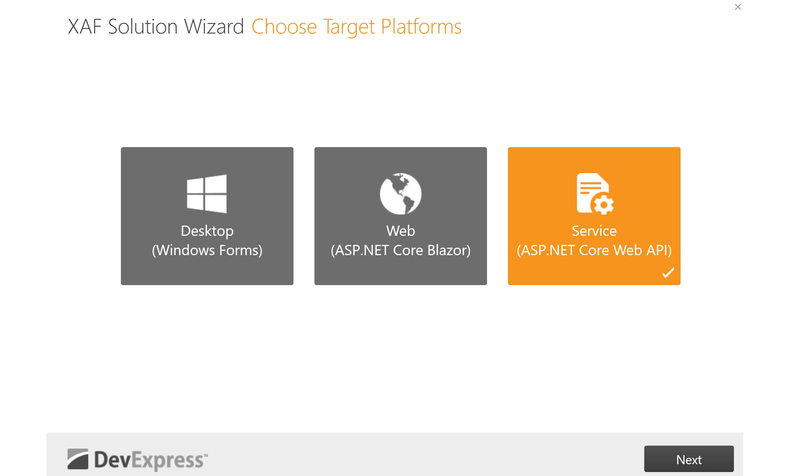

# How to Create a Web API Service Backend for a Blazor WebAssembly Application

This example demonstrates how you can create a [Web API service](https://docs.devexpress.com/eXpressAppFramework/113366/concepts/security-system/security-system-overview) backend and a Blazor WebAssembly application frontend. The backend uses EF Core for data access.

The application works with blog post data. It authenticates a user with cookies, determines his or her permissions, and selectively enables the following data operations:

- Lists existing Post records
- Displays a photo of a Post author
- Creates new Post records
- Archives a Post record
- Displays a report based on Post records

## Prerequisites

- [Visual Studio 2022 v17.0+](https://visualstudio.microsoft.com/vs/)
- [.NET SDK 6.0+](https://dotnet.microsoft.com/download/dotnet-core)
- [DevExpress Libraries v22.2+](https://www.devexpress.com/Products/Try/). Download and run our **Unified Component Installer**. Make sure to enable the **Cross-Platform .NET App UI & Web API service (XAF)** option in the list of products to install. The installer will register local NuGet package sources and Visual Studio templates required for this tutorial.

You don't have to use the **DevExpress Unified Component Installer** if you only want to run the example project or use the project as a boilerplate for your application. You can manually register your [NuGet feed URL](https://docs.devexpress.com/GeneralInformation/116042/installation/install-devexpress-controls-using-nuget-packages/obtain-your-nuget-feed-url) in Visual Studio as described in the following article: [Setup Visual Studio's NuGet Package Manager](https://docs.devexpress.com/GeneralInformation/116698/installation/install-devexpress-controls-using-nuget-packages/setup-visual-studios-nuget-package-manager).
  
  > **NOTE**
  >
  > If you’ve used a pre-release version of our components or obtained a hotfix from DevExpress, NuGet packages will not be restored automatically (you will need to update them manually). For more information, please refer to the following article: [Updating Packages](https://docs.devexpress.com/GeneralInformation/118420/Installation/Install-DevExpress-Controls-Using-NuGet-Packages/Updating-Packages). Remember to enable the [Include prerelease](https://docs.microsoft.com/en-us/nuget/create-packages/prerelease-packages#installing-and-updating-pre-release-packages) option.

## Build and Test a Basic Web API Service App (Backend)

### Create a Web API project using the XAF Solution Wizard

1. In Visual Studio, create a new project. Use the DevExpress XAF Template Gallery template. Enter appropriate project-related information and start the Wizard. On the first page, select only the following tile: **Service (ASP.NET Core Web API)**.

  

2. Select Entity Framework as your ORM.

  

3. Select **Standard Authentication** to generate relevant [JWT](https://en.wikipedia.org/wiki/JSON_Web_Token) authentication scaffolding code.

  

4. If you own a DevExpress [Universal Subscription](https://www.devexpress.com/subscriptions/universal.xml), the next page allows you to select additional modules for your Web API Service. Make certain to select **Reports** as this module is required to complete the tutorial (last step). You can select other modules if you plan to extend the application. Click **Finish**.

  
  
5. Modify the `WebAPI/Properties/launchSettings.json` file and remove the IIS Express profile so that `Kestrel server ports` will be utilized. Once complete, the file's `"profiles"` section should appear as shown below:

   _Properties/launchSettings.json_:
   ```json
   "profiles": {
      "WebAPI.WebApi": {
         "commandName": "Project",
         "dotnetRunMessages": "true",
         "launchBrowser": true,
         "launchUrl": "swagger",
         "applicationUrl": "https://localhost:5001;http://localhost:5000",
         "environmentVariables": {
         "ASPNETCORE_ENVIRONMENT": "Development"
         }
      }
   }
   }
   ```

For more information, refer to the following DevExpress help topic: [Create a Standalone Web API Application](https://docs.devexpress.com/eXpressAppFramework/403401/backend-web-api-service/create-new-application-with-web-api-service).

### Declare a data model

1. Declare the `Post` object.

   _BusinessObjects/Post.cs_
   ```cs
   [VisibleInReports]
   public class Post : BaseObject {
      public virtual string Title { get; set; }
      public virtual string Content { get; set; }
      public virtual ApplicationUser Author { get; set; }
      public override void OnCreated() {
         base.OnCreated();
         Author = ObjectSpace.FindObject<ApplicationUser>(CriteriaOperator.Parse("ID=CurrentUserId()"));
      }
   }
   ```

   In the code sample above, `Post` class inherits [BaseObject](https://docs.devexpress.com/eXpressAppFramework/DevExpress.Persistent.BaseImpl.BaseObject) to simplify data model implementation. This tutorial makes use of the following `BaseObject` features:

   - Predefined `Guid`-type primary key field (`ID`)
   - `OnCreated` lifecycle method
   - `ObjectSpace` property (allows you to communicate with the underlying data layer) 
   
   For more information, refer to the following DevExpress help topic: [BaseObjectSpace](https://docs.devexpress.com/eXpressAppFramework/DevExpress.ExpressApp.BaseObjectSpace).

2. Modify the Entity Framework DBContext with an additional DbSet.

   _BusinessObjects\WebAPIDbContext.cs_:
   ```cs
   public DbSet<Post> Posts { get; set; }
   ```

3. Add an `Email` property to the `ApplicationUser` object.

   _BusinessObjects/ApplicationUser.cs_:
   ```cs
   public class ApplicationUser : PermissionPolicyUser, ISecurityUserWithLoginInfo {
      // ...
      [FieldSize(255)]
      public virtual String Email { get; set; }
   }
   ```

4. Modify the `Startup.cs` file to register `built-in CRUD endpoints` for the Post object.

   _Startup.cs_:
   ```cs
   services
	 .AddXafWebApi(Configuration, options => {
	 	// Make your business objects available in the Web API and generate the GET, POST, PUT, and DELETE HTTP methods for it.
	 	// options.BusinessObject<YourBusinessObject>();
	 	options.BusinessObject<Post>();
	 });
   ```

### Set up a development database connection

The XAF Solution Wizard generates the connection string and startup code required to store persistent data in a [SQL Server Express LocalDB](https://learn.microsoft.com/en-us/sql/database-engine/configure-windows/sql-server-express-localdb) database (only available for Microsoft Windows). If you are planning to develop your Web API backend on a non-Windows machine, consider using [SQLite](https://www.sqlite.org/) instead.

To use SQLite, add the [Microsoft.EntityFrameworkCore.Sqlite](https://www.nuget.org/packages/Microsoft.EntityFrameworkCore.Sqlite) **v6** NuGet package to your project's dependencies. Once complete, add the following code to the `ConfigureServices` method within `Startup.cs`:

_Startup.cs_:
```cs
public void ConfigureServices(IServiceCollection services) {
   // ...
   services.AddDbContextFactory<WebAPIEFCoreDbContext>((serviceProvider, options) => { 
      if (RuntimeInformation.IsOSPlatform(OSPlatform.Windows)) {
         string connectionString = Configuration.GetConnectionString("ConnectionString");
         options.UseSqlServer(connectionString);
      }
      else {
         string sqliteDBPath = Path.Join(Environment.GetFolderPath(Environment.SpecialFolder.LocalApplicationData), "WebAPIDemo.db");
         options.UseSqlite($"Data Source={sqliteDBPath}");
      }
      // ...
   }
}
```

### Generate initial data

1. Open the `WebAPI/DatabaseUpdate/Updater.cs` file and add the following code to the `UpdateDatabaseAfterUpdateSchema` method to create appropriate users (Editor and Viewer), assign roles/permissions, and create sample Post objects:

   _DatabaseUpdate\Updater.cs_:
   ```cs
   var editorUser = ObjectSpace.FirstOrDefault<ApplicationUser>(user=>user.UserName=="Editor")??ObjectSpace.CreateObject<ApplicationUser>();
   if (ObjectSpace.IsNewObject(editorUser)) {
      //create Editor User/Role
      editorUser.UserName="Editor";
      editorUser.Email = "Editor@example.com";

      var editorRole = ObjectSpace.CreateObject<PermissionPolicyRole>();
      editorRole.Name = "EditorRole";
      editorRole.AddTypePermission<Post>(SecurityOperations.CRUDAccess, SecurityPermissionState.Allow);
      editorRole.AddTypePermission<ApplicationUser>(SecurityOperations.CRUDAccess, SecurityPermissionState.Allow);
      editorUser.Roles.Add(editorRole);
      editorUser.Roles.Add(defaultRole);
      editorUser.Photo = ObjectSpace.CreateObject<MediaDataObject>();
      editorUser.Photo.MediaData = GetResourceByName("Janete");

      //create Viewer User/Role
      var viewerUser = ObjectSpace.CreateObject<ApplicationUser>();
      viewerUser.UserName = "Viewer";
      viewerUser.Email = "Viewer@example.com";

      viewerUser.Photo = ObjectSpace.CreateObject<MediaDataObject>();
      viewerUser.Photo.MediaData = GetResourceByName("John");
      var viewerRole = ObjectSpace.CreateObject<PermissionPolicyRole>();
      viewerRole.Name = "ViewerRole";
      viewerRole.AddTypePermission<Post>(SecurityOperations.Read, SecurityPermissionState.Allow);
      viewerRole.AddTypePermission<ApplicationUser>(SecurityOperations.Read, SecurityPermissionState.Allow);
      viewerUser.Roles.Add(viewerRole);
      viewerUser.Roles.Add(defaultRole);

      //commit
      ObjectSpace.CommitChanges();

      //assign authentication type
      foreach (var user in new[] { editorUser, viewerUser }.Cast<ISecurityUserWithLoginInfo>()) {
         user.CreateUserLoginInfo(SecurityDefaults.PasswordAuthentication,
            ObjectSpace.GetKeyValueAsString(user));
      }

      //sample posts
      var post = ObjectSpace.CreateObject<Post>();
      post.Title = "Hello World";
      post.Content = "This is a FREE API for everybody";
      post.Author=editorUser;
      post = ObjectSpace.CreateObject<Post>();
      post.Title = "Hello Blazor WebAssembly";
      post.Content = "Please smash the like button to help our videos get discovered";
      post.Author=editorUser;
   }
   ```

### Configure application security

1. Modify the `ConfigureServices` method in `Startup.cs` to allow cross origin authenticated requests (CORS) from the Blazor WebAssembly application.

   _Startup.cs_:
   ```cs
   services.AddCors(options => options.AddPolicy(
      "Open", builder => builder.SetIsOriginAllowed(_ => true).AllowAnyHeader().AllowAnyMethod().AllowCredentials()));
   ```

   Additionally, modify the `Configure` method:

   _Startup.cs_:
   ```cs
   app.UseCors("Open");
   ```

2. Modify the code that configures authentication and authorization to use cookies:

   _Startup.cs_:
   ```cs
   var authentication = services.AddAuthentication(customBearerSchemeName);
   authentication.AddCookie(CookieAuthenticationDefaults.AuthenticationScheme);
   // ...
   services.AddAuthorization(options => {
      options.DefaultPolicy = new AuthorizationPolicyBuilder(
         CookieAuthenticationDefaults.AuthenticationScheme,
         JwtBearerDefaults.AuthenticationScheme,
         customBearerSchemeName)
            .RequireAuthenticatedUser()
            .RequireXafAuthentication()
            .Build();
   });
   ```

3. Create a `LoginAsync` endpoint in `API/Security/AuthenticationController.cs` to authenticate a user and send the authentication cookie to the client.

   _API/Security/AuthenticationController.cs_:
   ```cs
   [HttpPost(nameof(LoginAsync))]
   [SwaggerOperation("Checks if the user with the specified logon parameters exists in the database. If it does, authenticates this user.", "Refer to the following help topic for more information on authentication methods in the XAF Security System: <a href='https://docs.devexpress.com/eXpressAppFramework/119064/data-security-and-safety/security-system/authentication'>Authentication</a>.")]
   public async Task<ActionResult> LoginAsync([FromBody] [SwaggerRequestBody(@"For example: <br /> { ""userName"": ""Admin"", ""password"": """" }")]
      AuthenticationStandardLogonParameters logonParameters) {
      try {
         var user=await Task.Run(() => _securityAuthenticationService.Authenticate(logonParameters));
         if (user == null) return Unauthorized("User name or password is incorrect.");
         using var objectSpace = _nonSecuredObjectSpaceFactory.CreateNonSecuredObjectSpace<ApplicationUser>();
         var userOid = new Guid(user.Claims.First(c => c.Type == ClaimTypes.NameIdentifier).Value);
         var xafUser = objectSpace.FirstOrDefault<ApplicationUser>(u => u.ID == userOid);
         (((ClaimsIdentity)user.Identity)!).AddClaims(new[]{new Claim(nameof(ApplicationUser.ID),xafUser.ID.ToString()),new Claim(nameof(ApplicationUser.IsActive),xafUser.IsActive.ToString()), });
         return new SignInResult(CookieAuthenticationDefaults.AuthenticationScheme,
               user, new AuthenticationProperties { AllowRefresh = true, ExpiresUtc = DateTimeOffset.Now.AddDays(1), IsPersistent = true, });
      } catch(AuthenticationException) {
         return Unauthorized("User name or password is incorrect.");
      }
   }
   ```

4. In the same file, create a `LogoutAsync` endpoint used to log out and invalidate the cookie.

   _API/Security/AuthenticationController.cs_:
   ```cs
   [HttpPost(nameof(LogoutAsync))]
   public async Task<SignOutResult> LogoutAsync() {
      await HttpContext.SignOutAsync(CookieAuthenticationDefaults.AuthenticationScheme);
      return new SignOutResult(CookieAuthenticationDefaults.AuthenticationScheme);
   }
   ```

5. Create an authorized `UserInfo` endpoint used to get user information and validate the cookie from the client when needed (for example, when a user refreshes the page).

   _API/Security/AuthenticationController.cs_:
   ```cs
   [Authorize][HttpGet(nameof(UserInfo))]
   public ActionResult UserInfo() {
      if (HttpContext.User.Identity?.IsAuthenticated == null || !HttpContext.User.Identity.IsAuthenticated)
         return Unauthorized();
      var claims = ((ClaimsIdentity)HttpContext.User.Identity).Claims.ToArray();
      return Ok(new {
         UserName= HttpContext.User.Identity.Name, 
         ID = claims.First(claim => claim.Type == nameof(ApplicationUser.ID)).Value.ToString(),
         IsActive = claims.First(claim => claim.Type == nameof(ApplicationUser.IsActive)).Value.ToString()
      });
   }
   ```

### Use Swagger UI to test the Web API service

At this point, you can run your Web API service and use the Swagger interface to authenticate as previously defined users and test generated endpoints (for example, query available posts). Refer to the following article for additional information [Test the Web API with Swagger or Postman](https://docs.devexpress.com/eXpressAppFramework/404281/backend-web-api-service/test-the-web-api-with-swagger-postman).


## Create a Blazor WebAssembly application (Frontend)

### Create a new Blazor WebAssembly project

1. Use either the .NET CLI or Visual Studio New Project wizard to add a new Blazor WebAssembly project to the solution.

   ```cmd
   dotnet new blazorwasm -o Blazor.WebAssembly
   ```

2. Add the required NuGet packages to the Blazor WebAssembly project.

   ```cmd
   dotnet add package Blazored.LocalStorage --version 4.3.0
   dotnet add package Microsoft.AspNetCore.Components.WebAssembly.Authentication --version 7.0.4
   dotnet add package Microsoft.Extensions.Http --version 7.0.0
   dotnet add package Microsoft.AspNetCore.Components.WebAssembly.Authentication --version 7.0.4
   dotnet add package Simple.OData.Client --version 6.0.1
   dotnet add package DevExpress.Blazor --version 22.2.4
   ```

### Register installed packages services

1. Modify the `Program.cs` file as follows:

   _Program.cs_:
   ```cs
   builder.Services.AddOptions();
   builder.Services.AddAuthorizationCore();
   builder.Services.AddBlazoredLocalStorage();
   builder.Services.AddDevExpressBlazor(options => {
      options.BootstrapVersion = DevExpress.Blazor.BootstrapVersion.v5;
      options.SizeMode = DevExpress.Blazor.SizeMode.Medium;
   });
   ```

2. Register DevExpress styles in the header of `wwwroot/index.html`.

   _wwwroot/index.html_:
   ```html
   <link href="_content/DevExpress.Blazor.Themes/blazing-berry.bs5.css" rel="stylesheet" asp-append-version="true" />
   ```

3. Add the following lines to `_Imports.razor`.

   __Imports.razor_:
   ```cs
   @using Microsoft.AspNetCore.Authorization
   @using Microsoft.AspNetCore.Components.Authorization
   @using Blazored.LocalStorage
   @using Microsoft.AspNetCore.Components
   @using Microsoft.AspNetCore.Components.WebAssembly.Authentication
   @using System.Web
   @using DevExpress.Blazor
   @using System.ComponentModel.DataAnnotations
   ```

### Configure cookie-based authentication on the frontend

1. Configure the HTTP client. Modify the `HttpClient` registration code to use the Web API service's base address and add a handler to set the browser's request credentials.
  
   _Services/CookieHandler.cs_:
   ```cs
   public class CookieHandler : DelegatingHandler {
         protected override async Task<HttpResponseMessage> SendAsync(HttpRequestMessage request, CancellationToken cancellationToken) {
            request.SetBrowserRequestCredentials(BrowserRequestCredentials.Include);
            return await base.SendAsync(request, cancellationToken);
         }
      }
   ```

   _Program.cs_:
   ```cs
   using Blazor.WebAssembly.Services;
   // ...
   builder.Services.AddHttpClient("API", options => options.BaseAddress = new Uri("https://localhost:5001/api/"))
      .AddHttpMessageHandler<CookieHandler>();
   ```

2. Implement a user model class.

   _Models/UserModel.cs_:
   ```cs
   namespace Blazor.WebAssembly.Models;

   public class UserModel {
      public Guid XafUserId { get; set; }
      public string LoginProviderUserId { get; set; } = null!;
      public string UserName { get; set; } = null!;
      public string? Email { get; set; }
   }
   ```

3. Implement and register a custom `AuthenticationStateProvider`:

   _Services/WebAPIAuthenticationStateProvider.cs_:
   ```cs
   using System.Security.Claims;
   using Blazor.WebAssembly.Models;
   using Microsoft.AspNetCore.Components.Authorization;
   // ...
   public class WebAPIAuthenticationStateProvider : AuthenticationStateProvider {
      private ClaimsPrincipal _claimsPrincipal = new(new ClaimsIdentity());
      public override Task<AuthenticationState> GetAuthenticationStateAsync()
         => Task.FromResult<AuthenticationState>(new(_claimsPrincipal));

      public void ClearAuthInfo() {
         _claimsPrincipal = new ClaimsPrincipal(new ClaimsIdentity());
         NotifyAuthenticationStateChanged(GetAuthenticationStateAsync());
      }

      public void SetAuthInfo(UserModel user) {
         _claimsPrincipal = new ClaimsPrincipal(new ClaimsIdentity(new[]{
               new Claim(nameof(UserModel.Email), user.Email ?? ""),
               new Claim(nameof(UserModel.XafUserId), user.XafUserId.ToString()),
               new Claim(nameof(UserModel.LoginProviderUserId), user.LoginProviderUserId.ToString()),
               new Claim(ClaimTypes.Name, user.UserName),
               new Claim("ID", user.ToString()!) }, "AuthCookie"));
         NotifyAuthenticationStateChanged(GetAuthenticationStateAsync());
      }
   }
   ```

   _Program.cs_:
   ```cs
   builder.Services.AddScoped<WebAPIAuthenticationStateProvider>();
   builder.Services.AddScoped<AuthenticationStateProvider>(provider => provider.GetRequiredService<WebAPIAuthenticationStateProvider>());
   ```

4. Create and register an `IWebAPI` service to call authentication endpoints of the WebAPI service backend.

   _Services/WebAPI.cs_:
   ```cs
   using System.Net;
   using System.Net.Http.Json;
   using Blazor.WebAssembly.Models;
   // ...

   public interface IWebAPI {
      Task<HttpResponseMessage> LoginAsync(string? userName, string? password);
      Task<(string message, UserModel? user)> GetUserAsync();
      Task<bool> LogoutAsync();
   }

   public class WebAPI : IWebAPI {
      private readonly HttpClient _httpClient;

      public WebAPI(IHttpClientFactory httpClientFactory)
         => _httpClient = httpClientFactory.CreateClient("API");

      public async Task<HttpResponseMessage> LoginAsync(string? userName, string? password)
         => (await _httpClient.PostAsJsonAsync("Authentication/LoginAsync", new { userName, password }));

      public async Task<(string message, UserModel? user)> GetUserAsync() {
         try {
               var response = await _httpClient.GetAsync("Authentication/UserInfo");
               return response.IsSuccessStatusCode ? ("Success", await response.Content.ReadFromJsonAsync<UserModel>())
                  : response.StatusCode == HttpStatusCode.Unauthorized ? ("Unauthorized", null) : ("Failed", null);
         }
         catch (Exception e) {
               return ("Failed", null);
         }
      }

      public async Task<bool> LogoutAsync()
         => (await _httpClient.PostAsync("Authentication/LogoutAsync", null)).IsSuccessStatusCode;
   }
   ```

   _Program.cs_:
   ```cs
   builder.Services.AddScoped<IWebAPI, WebAPI>();
   ```

5. Create a `RedirectToLogin` component:

   _Shared/RedirectToLogin.razor_:
   ```cs
   @inject NavigationManager Navigation

   @code {
      protected override void OnInitialized() 
         => Navigation.NavigateTo($"Login?returnUrl={Uri.EscapeDataString(Navigation.Uri)}");
   }
   ```

6. Modify the `App.Razor` file. In the markup, replace the `RouteView` component with the `AuthorizedRouteView`.

   _App.Razor_:
   ```razor
   <AuthorizeRouteView RouteData="@routeData" DefaultLayout="@typeof(MainLayout)">
      <NotAuthorized>
         <RedirectToLogin />
      </NotAuthorized>
   </AuthorizeRouteView>
   ```

7. To validate the authentication cookie, modify the `App.Razor` file as follows.

   Inject the following services in `App.Razor`:

   _App.Razor_:
   ```cs
   @using Blazor.WebAssembly.Services
   @inject ILocalStorageService LocalStorageService;
   @inject IWebAPI WebApi
   @inject WebAPIAuthenticationStateProvider AuthStateProvider
   ```

   Enclose all markup within `App.razor` with a `CascadingAuthenticationState` component.

   _App.Razor_:
   ```razor
   <CascadingAuthenticationState>
      @* App.Razor markup *@
   </CascadingAuthenticationState>
   ```

   In the same file, handle the Router's `OnNavigateAsync` event to get the user profile or re-populate it if needed.

   _App.Razor_:
   ```razor
   <Router AppAssembly="@typeof(App).Assembly" 
      OnNavigateAsync="@OnNavigateAsync" 
      >
      @* ... *@
   ```

   ```cs
   @code{
      private async Task OnNavigateAsync(NavigationContext args) {
         var isAuthenticated =  await LocalStorageService.GetItemAsync<string>("IsAuthenticated");
         var claimsPrincipal = (await AuthStateProvider.GetAuthenticationStateAsync()).User;
         if(!string.IsNullOrEmpty(isAuthenticated) && !claimsPrincipal.Identity!.IsAuthenticated ){
               var user = await WebApi.GetUserAsync();
               if (user.message == "Success") {
                  AuthStateProvider.SetAuthInfo(user.user!);
               }
               else if(user.message == "Unauthorized") {
                  AuthStateProvider.ClearAuthInfo();
                  await LocalStorageService.RemoveItemAsync("IsAuthenticated");
                  await WebApi.LogoutAsync();
               } else if(user.message == "Failed") {
                  AuthStateProvider.ClearAuthInfo();
                  await LocalStorageService.RemoveItemAsync("IsAuthenticated");
               }
         }
      }
   }
   ```

8. Create login components. To do this, create a `LoginDisplay.razor` file inside the `Shared` folder. In this file, implement the following functionality:
   - Use the `AuthorizeView` component to display either the `Login` or `Logout` component. 
   - Handle the `Logout` event. 
   - Display user profile information in a `DxPopup` component.

   _Shared/LoginDisplay.razor_:
   ```razor
   @using Blazor.WebAssembly.Models
   @using Blazor.WebAssembly.Services
   @inject WebAPIAuthenticationStateProvider AuthStateProvider
   @inject NavigationManager NavigationManager
   @inject IWebAPI WebApi
   @inject ILocalStorageService LocalStorageService;
   <AuthorizeView>
      <Authorized>
         <a href="" @onclick="OnProfileClicked">Hello @context.User.Identity?.Name</a>
         <button type="button" @onclick="Logout" class="nav-link btn btn-link">Log out</button>
      </Authorized>
      <NotAuthorized>
         <a href="/login">Log in</a>
      </NotAuthorized>
   </AuthorizeView>
   <DxPopup HeaderText="Profile" @bind-Visible="@PopupVisible">
      <BodyContentTemplate>
         <div>
               <label for="userId">UserID:</label>
               <label id="userId">@_userId</label>
         </div>
         <div>
               <label for="loginProviderUserId">LoginProviderUserID:</label>
               <label id="loginProviderUserId">@_loginProviderUserId</label>
         </div>
         <div>
               <label for="Email">Email:</label>
               <label id="Email">@_userEmail</label>
         </div>
      </BodyContentTemplate>
   </DxPopup>

   @code {
      private string? _userId;
      private string? _loginProviderUserId;
      private string? _userEmail;
      bool PopupVisible { get; set; } = false;

      private async Task Logout() {
         if (await WebApi.LogoutAsync()) {
               AuthStateProvider.ClearAuthInfo();
               await LocalStorageService.RemoveItemAsync("IsAuthenticated");
               NavigationManager.NavigateTo("/", true);
         }
      }

      private async Task OnProfileClicked() {
         var userClaims = (await AuthStateProvider.GetAuthenticationStateAsync()).User.Claims;
         _loginProviderUserId = userClaims.First(claim => claim.Type == nameof(UserModel.LoginProviderUserId)).Value;
         _userId = userClaims.First(claim => claim.Type == nameof(UserModel.XafUserId)).Value;
         _userEmail = userClaims.First(claim => claim.Type == nameof(UserModel.Email)).Value;
         PopupVisible = true;
      }

   }
   ```

   Render the component inside `MainLayout.razor` next to the _About_ button.

   _Shared/MainLayout.razor_:
   ```html
   <div class="top-row px-4">
      <a href="https://docs.microsoft.com/aspnet/" target="_blank">About</a>
      <LoginDisplay></LoginDisplay>
   </div>
   ```

   Create a `Login.razor` page.

   _Pages/Login.razor_:
   ```razor
   @page "/login"
   @using Blazor.WebAssembly.Services
   @inject IWebAPI WebApi
   @inject NavigationManager NavigationManager
   @inject ILocalStorageService LocalStorageService;
   <div class="d-flex justify-content-center" >
         <ErrorBoundary @ref="_errorBoundary">
               <ChildContent>
                  <EditForm Model="@this" OnSubmit="LoginAsync" Context="EditFormContext">
                     <DataAnnotationsValidator/>
                     <div class="card-body  align-content-around">
                           <DxFormLayout>
                              <DxFormLayoutItem ColSpanMd="12">
                                 <DxTextBox @bind-Text="@UserName" NullText="Username" ClearButtonDisplayMode="DataEditorClearButtonDisplayMode.Auto"/>
                                 <div class="text-danger"><ValidationMessage For="@(() => UserName)"/></div>
                              </DxFormLayoutItem>
                              <DxFormLayoutItem ColSpanMd="12">
                                 <DxTextBox @bind-Text="@Password" NullText="Password" Password="true" ClearButtonDisplayMode="DataEditorClearButtonDisplayMode.Auto"/>
                                 <div class="text-danger"><ValidationMessage For="@(() => Password)"/></div>
                              </DxFormLayoutItem>
                              <DxFormLayoutItem ColSpanMd="12">
                                 <div class="text-danger"><ValidationMessage For="@(() => AuthenticationResult)"/></div>
                              </DxFormLayoutItem>
                              <DxFormLayoutItem ColSpanMd="12">
                                 <DxButton Text="Login" RenderStyle="ButtonRenderStyle.Primary" SubmitFormOnClick="true"/>
                              </DxFormLayoutItem>
                           </DxFormLayout>
                     </div>
                  </EditForm>
               </ChildContent>
               <ErrorContent Context="e">
                  <DxPopup HeaderText="@e.GetType().ToString()" Visible="true" Closed="() => _errorBoundary.Recover()">
                     @e.Message
                  </DxPopup>
               </ErrorContent>
         </ErrorBoundary>      
   </div>
   @code {
      private ErrorBoundary _errorBoundary = new();
      [Required]
      public string? UserName { get; set; } 
      public string? Password { get; set; }
      [DisplayStringPropertyValue()]
      public string? AuthenticationResult { get; set; } 
      private async Task LoginAsync(EditContext editContext) {
         AuthenticationResult = "";
         if (editContext.Validate()){
               var responseMessage = await WebApi.LoginAsync(UserName,Password);
               if (!responseMessage.IsSuccessStatusCode) {
                  AuthenticationResult = $"Authentication error ({responseMessage.StatusCode}): {await responseMessage.Content.ReadAsStringAsync()}";
                  editContext.Validate();
                  return;
               }
               await LocalStorageService.SetItemAsStringAsync("IsAuthenticated", "true");
               NavigationManager.NavigateTo(HttpUtility.ParseQueryString(new Uri(NavigationManager.Uri).Query).Get("returnUrl") ?? "/");
         }
      }
   }
   ```

9. Run the Blazor WebAssembly application and test the authentication logic.

   - Wrong credentials:

     
   
   - Unhandled error:
     
     
   
   - Authentication success:
   
     
   
   - User profile info:
   
     

### Request and display Post records

1. Create a `Post` model class:

   _Models/Post.cs_:
   ```cs
   namespace Blazor.WebAssembly.Models;

   public class Post {
      public int PostId { get; set; }
      public string? Title { get; set; }
      public string? Content { get; set; }
   }
   ```

2. Implement a custom data source for the DxGrid control. In the data source implementation, use an OData client to fetch posts from the Web API Service:

   _Services/SimpleODataClientDataSource.cs_:
   ```cs
   using System.Collections;
   using Blazor.WebAssembly.Models;
   using DevExpress.Blazor;
   using DevExpress.Data.Filtering;
   using DevExpress.Data.Filtering.Helpers;
   using Simple.OData.Client;
   // ...
   public class SimpleODataClientDataSource : GridCustomDataSource {
      private readonly ODataClient _client;
      public SimpleODataClientDataSource(IHttpClientFactory httpClientFactory)
         => _client = new ODataClient(new ODataClientSettings(httpClientFactory.CreateClient("API"), new Uri("odata/", UriKind.Relative)));

      public override async Task<int> GetItemCountAsync(GridCustomDataSourceCountOptions options, CancellationToken cancellationToken)
         => await ApplyFiltering(options.FilterCriteria, _client.For<Post>()).Count()
            .FindScalarAsync<int>(cancellationToken);

      public override async Task<IList> GetItemsAsync(GridCustomDataSourceItemsOptions options, CancellationToken cancellationToken) {
         var filteredClient = ApplyFiltering(options.FilterCriteria, _client.For<Post>().Top(options.Count).Skip(options.StartIndex));
         return (await ApplySorting(options, filteredClient).FindEntriesAsync(cancellationToken)).ToList();
      }

      private static IBoundClient<Post> ApplyFiltering(CriteriaOperator criteria, IBoundClient<Post> boundClient)
         => !criteria.ReferenceEqualsNull() ? boundClient.Filter(ToSimpleClientCriteria(criteria)) : boundClient;

      private static string ToSimpleClientCriteria(CriteriaOperator criteria)
         => $"{criteria}".Replace("[", "").Replace("]", "");

      private static IBoundClient<Post> ApplySorting(GridCustomDataSourceItemsOptions options, IBoundClient<Post> boundClient)
         => options.SortInfo.Any() ? boundClient.OrderBy(options.SortInfo
                  .Where(info => !info.DescendingSortOrder).Select(info => info.FieldName).ToArray())
            .OrderByDescending(options.SortInfo
                  .Where(info => info.DescendingSortOrder).Select(info => info.FieldName).ToArray()) : boundClient;
   }
   ```

   For more information, refer to the following documentation topic: https://docs.devexpress.com/Blazor/DevExpress.Blazor.GridCustomDataSource

3. Add a DxGrid control bound to your custom data source to the `FetchData.razor` page.

   _Pages/FetchData.razor_:
   ```razor
   @page "/fetchdata"
   @using Blazor.WebAssembly.Models
   @using Blazor.WebAssembly.Services
   @attribute [Authorize]
   @inject IJSRuntime Js;
   @inject IWebAPI WebAPI;
   @inject SimpleODataClientDataSource DataSource;
   <DxGrid Data="@DataSource" CssClass="mw-1100" KeyFieldName="ID" ShowFilterRow="true">
      <Columns>
         @*<DxGridSelectionColumn Width="104px" />*@
         <DxGridDataColumn Caption="Title" FieldName="Title"/>
         <DxGridDataColumn Caption="Content" FieldName="Content"/>
      </Columns>
   </DxGrid>
   ```

   Run the Blazor WebAssembly application and select the _Fetch data_ tab to view the result. 

   

## Extend backend and frontend apps

### Display author photo

1. Implement a Web API service endpoint to serve the author's photo based on the post ID. 

   First, add the `Photo` property to the `ApplicationUser` persistent class:

   _BusinessObjects/ApplicationUser.cs_:
   ```cs
   public class ApplicationUser : PermissionPolicyUser, ISecurityUserWithLoginInfo {
      // ...
      public virtual MediaDataObject Photo { get; set; }
   }
   ```

   Modify the Module Updater. Add logic to assign photos to predefined users:

   _DatabaseUpdate\Updater.cs_:
   ```cs
   // ...
   editorUser.Photo = ObjectSpace.CreateObject<MediaDataObject>();
   editorUser.Photo.MediaData = GetResourceByName("Janete");
   viewerUser.Photo = ObjectSpace.CreateObject<MediaDataObject>();
   viewerUser.Photo.MediaData = GetResourceByName("John");
   // ...
   ```

   > **NOTE**
   >
   > In our example code, the `GetResourceByName` method returns a byte array representation of an account image based on name. You can find an implementation for this method in the Web API project's [_DatabaseUpdate/Updater.cs_](./WebApi/DatabaseUpdate/Updater.cs) file. Note that this implementation requires the image resources to be compiled into the application's assembly (the .jpg files' `Build Action` option must be set to `Embedded resource`).

   Add a `CustomEndPointController` inside the `WebAPI/API` directory, and inject the `ISecurityProvider` and `IObjectSpaceFactory`. Implement a controller action that serves post author photos as follows.

   _API/CustomEndPointController.cs_:

   ```cs
   [ApiController]
   [Route("api/[controller]")]
   [Authorize]
   public class CustomEndPointController : ControllerBase {
      private readonly ISecurityProvider _securityProvider;
      private readonly IObjectSpaceFactory _securedObjectSpaceFactory;

      public CustomEndPointController(ISecurityProvider securityProvider, IObjectSpaceFactory securedObjectSpaceFactory) {
         _securityProvider = securityProvider;
         _securedObjectSpaceFactory = securedObjectSpaceFactory;
      }

      [HttpGet("AuthorPhoto/{postId}")]
      public FileStreamResult AuthorPhoto(Guid postId) {
         using var objectSpace = _securedObjectSpaceFactory.CreateObjectSpace(typeof(Post));
         var post = objectSpace.GetObjectByKey<Post>(postId);
         var photoBytes = post.Author.Photo.MediaData;
         return File(new MemoryStream(photoBytes), "application/octet-stream");
      }  
   }
   ```

2. In the Blazor WebAssembly project, update the `IWebAPI` service with a method that requests a post author's photo.

   _Services/WebAPI.cs_:
   ```cs
   public interface IWebAPI {
      // ...
      Task<byte[]> GetAuthorPhotoAsync(Guid postId);
   }
   public class WebAPI : IWebAPI {
      // ...
      public async Task<byte[]> GetAuthorPhotoAsync(Guid postId)
         => await _httpClient.GetByteArrayAsync($"CustomEndPoint/AuthorPhoto/{postId}");
   }
   ```

3. Update the `FetchData.razor` page's layout:

   _Pages/FetchData.razor_:
   ```razor
   <DxGrid Data="@DataSource" CssClass="mw-1100" KeyFieldName="ID" ShowFilterRow="true">
      <Columns>
         @* ... *@ 
         <DxGridDataColumn FieldName="ID" Caption="Photo" AllowSort="false" Width="90px" MinWidth="100" TextAlignment="GridTextAlignment.Center">
               <CellDisplayTemplate><button class="btn btn-link" @onclick="() => ShowPhoto((Guid)context.Value)">Photo</button></CellDisplayTemplate>
         </DxGridDataColumn>
      </Columns>
   </DxGrid>

   <DxPopup HeaderText="Photo" @bind-Visible="ShowingPhoto">
      <BodyContentTemplate>
         
      </BodyContentTemplate>
   </DxPopup>

   @code {
      bool ShowingPhoto { get; set; }
      private string _imageDataUrl = "";
      private async Task ShowPhoto(Guid contextValue) {
         _imageDataUrl = $"data:image/jpg+xml;base64,{Convert.ToBase64String(await WebAPI.GetAuthorPhotoAsync(contextValue))}";
         ShowingPhoto = true;
      }
   }
   ```


### Enable post editing

1. The Web API Service automatically generates OData endpoints required to create and edit business objects. However, the example application's security system is configured to disallow post creation and editing for certain users. To check permissions before a user can try and submit a post, implement a custom `CanCreate` endpoint.

   _API/CustomEndPointController.cs_:
   ```cs
   [HttpGet(nameof(CanCreate))]
   public IActionResult CanCreate(string typeName) {
       var strategy = (SecurityStrategy)_securityProvider.GetSecurity();
       var objectType = strategy.TypesInfo.PersistentTypes.First(info => info.Name  == typeName).Type;
       return Ok(strategy.CanCreate(objectType));
   }
   ```

2. In the Blazor WebAssembly project, update the `IWebAPI` service with a method with a method that queries the `CanCreate` endpoint to check if the current user can edit Posts.

   _Services/WebAPI.cs_:
   ```cs
   public interface IWebAPI {
      // ...
      Task<bool> CanCreateAsync();
   }
   public class WebAPI: IWebAPI {
      // ...
      public async Task<bool> CanCreateAsync() 
         => await _httpClient.GetFromJsonAsync<bool>("CustomEndpoint/CanCreate?typename=Post");
   }
   ```

3. Update the DxGrid's data source with methods required to edit and delete posts.

   _Services/SimpleODataClientDataSource.cs_:
   ```cs
   public class SimpleODataClientDataSource : GridCustomDataSource {
      // ...
      public async Task DeleteAsync(Post instance)
      => await _client.For<Post>().Key(instance.ID).DeleteEntryAsync();

      public async Task AddOrUpdateAsync(Post instance, bool update = false) {
         if (!update) {
               await _client.For<Post>().Set(new { instance.Title, instance.Content }).InsertEntryAsync();
         }
         else {
               await _client.For<Post>().Key(instance.ID).Set(instance).UpdateEntryAsync();
         }
      }
   }
   ```

4. Add a command column with _New_, _Edit_ and _Delete_ commands to the DxGrid and implement logic required process CRUD operations.

   _Pages/FetchData.razor_:
   ```razor
   <DxGrid Data="@DataSource" CssClass="mw-1100" KeyFieldName="ID" ShowFilterRow="true"
      EditModelSaving="async e => await DataSource.AddOrUpdateAsync((Post)e.EditModel,!e.IsNew)"
      DataItemDeleting="async e => await DataSource.DeleteAsync((Post)e.DataItem)"
      EditMode="GridEditMode.EditRow" EditorRenderMode="GridEditorRenderMode.Integrated">
      <Columns>
         <DxGridCommandColumn Width="160px" Visible="AllowEdit" />
         <DxGridDataColumn Caption="Title" FieldName="Title">
               <CellEditTemplate>
                  <DxTextBox @bind-Text="((Post)context.EditModel).Title"></DxTextBox>
               </CellEditTemplate>
         </DxGridDataColumn>
         <DxGridDataColumn Caption="Content" FieldName="Content">
               <CellEditTemplate>
                  <DxTextBox @bind-Text="((Post)context.EditModel).Content"></DxTextBox>
               </CellEditTemplate>
         </DxGridDataColumn>
         <DxGridDataColumn FieldName="ID" Caption="Photo" AllowSort="false" Width="90px" MinWidth="100" TextAlignment="GridTextAlignment.Center">
               <CellDisplayTemplate><button class="btn btn-link" @onclick="() => ShowPhoto((Guid)context.Value)">Photo</button></CellDisplayTemplate>
         </DxGridDataColumn>
      </Columns>
   </DxGrid>
   @* ... *@ 
   @code {
      // ...
      public bool AllowEdit { get; set; }

      protected override async Task OnInitializedAsync() {
         await base.OnInitializedAsync();
         AllowEdit = await WebAPI.CanCreateAsync();
      }
   }
   ```


### Allow users to archive records

1. In the Web API service, create an `Archive` endpoint. This endpoint will obtain a post from the database and archive the post to disk. The following controller action implementation uses `securedObjectSpaceFactory` to communicate with the data store so that all data operations respect appropriate security permissions. 

   _API/CustomEndPointController.cs_:
   ```cs
   [HttpPost(nameof(Archive))]
   public async Task<IActionResult> Archive([FromBody] Post post) {
       using var objectSpace = _securedObjectSpaceFactory.CreateObjectSpace<Post>();
       post = objectSpace.GetObject(post);
       var photo = post.Author.Photo.MediaResource.MediaData;
       await System.IO.File.WriteAllTextAsync($"{post.ID}",
           JsonSerializer.Serialize(new { photo, post.Title, post.Content, post.Author.UserName }));
       return Ok();
   }
   ```

2. Extend the Blazor WebAssembly application's `IWebAPI` service with a method that archives a post.

   _Services/WebAPI.cs_:
   ```cs
   public interface IWebAPI {
      Task ArchiveAsync(Post post);
      // ...
   }
   public class WebAPI: IWebAPI {
      public async Task ArchiveAsync(Post post) 
         => await _httpClient.PostAsJsonAsync("CustomEndPoint/Archive", post);
      // ...
   }
   ```

3. In `FetchData.razor`, add a selection column to the DxGrid, a popup that displays the operation's result and a button that a user can click to archive the selected post.

   _Pages/FetchData.razor_:
   ```razor
   <DxButton SizeMode="SizeMode.Small" Text="Archive" RenderStyle="ButtonRenderStyle.Secondary" Click="OnArchive" Attributes="@(new Dictionary<string, object> {  ["title"] = "Archive Post selection." })" />
   <DxGrid Data="@DataSource" 
      @bind-SelectedDataItems="SelectedDataItems" 
      SelectionMode="GridSelectionMode.Single" 
      @* ... *@ >
      <Columns>
         <DxGridSelectionColumn Width="104px" />
         @* ... *@
      </Columns>
   </DxGrid>
   @* ... *@
   <DxPopup HeaderText="Archive" @bind-Visible="ArchiveClicked" BodyText="This post is saved to disk">
      <BodyContentTemplate>
         <div>
               @if (SelectedDataItems == null) {
                  <p>Please select a Post from the list.</p>
               }
               else {
                  <p>This post is saved to disk.</p>
               }
         </div>
      </BodyContentTemplate>
   </DxPopup>
   @code {
      // ...
      IReadOnlyList<object>? SelectedDataItems { get; set; }
      bool ArchiveClicked { get; set; }
      private async Task OnArchive(MouseEventArgs arg) {
         if (SelectedDataItems != null) {
               await WebAPI.ArchiveAsync(SelectedDataItems.Cast<Post>().First());
         }
         ArchiveClicked = true;
      }
   }
   ```


### Add reporting functionality

The [XAF Reports module](https://docs.devexpress.com/eXpressAppFramework/113591/shape-export-print-data/reports/reports-v2-module-overview?p=netframework) ships as part of the DevExpress [Universal Subscription](https://www.devexpress.com/subscriptions/universal.xml). You can use it to easily integrate [DevExpress Reports](https://www.devexpress.com/subscriptions/reporting/) into your backend Web API service. You can skip this step if you do not own the DevExpress Universal Subscription.

To create and initialize a report:

1. Add a DevExpress Report component using the Visual Studio New Item wizard.
2. Drag and drop a `CollectionDataSource` component from the Visual Studio toolbox and change its `ObjectTypeName` to `WebAPI.BusinessObjects.Post`.
3. Drag & drop all discovered fields from the Field List window onto the Report details surface.

    
4. Use a predefined reports updater to initialize the report.

   _Module.cs_:
   ```cs
   public override IEnumerable<ModuleUpdater> GetModuleUpdaters(IObjectSpace objectSpace, Version versionFromDB) {
        var predefinedReportsUpdater = new PredefinedReportsUpdater(Application, objectSpace, versionFromDB);
        predefinedReportsUpdater.AddPredefinedReport<XtraReport1>("Post Report",typeof(Post));
        return new ModuleUpdater[] { new DatabaseUpdate.Updater(objectSpace, versionFromDB),predefinedReportsUpdater };
    }
   ```
   For more information on report generation, refer to the following DevExpress help topic: [Create a Report in Visual Studio](https://docs.devexpress.com/XtraReports/14989/get-started-with-devexpress-reporting/create-a-report-in-visual-studio#add-a-new-report).

   For more information on the use of predefined static reports in XAF, refer to the following DevExpress help topic: [Create Predefined Static Reports](https://docs.devexpress.com/eXpressAppFramework/113645/shape-export-print-data/reports/create-predefined-static-reports).

   > Watch video: [Preview Reports as PDF in .NET MAUI Apps using Backend Web API service Endpoints with EF Core](https://www.youtube.com/watch?v=bn4iF5Gc9XY)

5. Create a `GetReport` endpoint. It redirects to the built-in `DownloadByName` endpoint and returns a Report with title _Post Report_.

   _API/CustomEndPointController.cs_:
   ```cs
   [HttpGet(nameof(GetReport))]
   public RedirectResult GetReport() 
       => Redirect("~/api/report/DownloadByName(Post Report)");
   ```

6. Extend the Blazor WebAssembly application's `IWebAPI` service with a method that requests a report.

   _Services/WebAPI.cs_:
   ```cs
   public interface IWebAPI {
      Task<byte[]> ShapePostsAsync();
      // ...
   }
   public class WebAPI: IWebAPI {
      public async Task<byte[]> ShapePostsAsync()
         => await _httpClient.GetByteArrayAsync("report/DownloadByName(Post Report)");
      // ...
   }
   ```

7. Add a button and code required to call the `IWebAPI.ShapePostsAsync` method to `FetchData.razor`. 

   _Pages/FetchData.razor_:
   ```razor
   <DxButton SizeMode="SizeMode.Small" Text="Archive" RenderStyle="ButtonRenderStyle.Secondary" Click="OnArchive" Attributes="@(new Dictionary<string, object> {  ["title"] = "Archive Post selection." })" />
   @* ... *@
   @code {
      // ...
      private async Task OnShape()
         => await Js.InvokeAsync<object>("saveAsFile", "Report.pdf", Convert.ToBase64String(await WebAPI.ShapePostsAsync()));
   }
   ```


