This example demonstrates how to use our [Web API Service](https://docs.devexpress.com/eXpressAppFramework/113366/concepts/security-system/security-system-overview) with a mobile .NET MAUI application using EF Core for data access. Our .NET MAUI application will use API endpoints for the Post business object to implement the following common scenarios:

- Authenticate and authorize users from different roles;
- List existing Post records;
- Create new Post records;
- Display a report based on Post records;
- Archive a Post record;
- Display a photo of a Post author.

## Prerequisites

- [Visual Studio 2022 v17.0+](https://visualstudio.microsoft.com/vs/)
- [.NET SDK 6.0+](https://dotnet.microsoft.com/download/dotnet-core)
- [Download and run our Unified Component Installer](https://www.devexpress.com/Products/Try/) or add [NuGet feed URL](https://docs.devexpress.com/GeneralInformation/116042/installation/install-devexpress-controls-using-nuget-packages/obtain-your-nuget-feed-url) to Visual Studio NuGet feeds.
  
  *We recommend that you select all products when you run the DevExpress installer. It will register local NuGet package sources and item / project templates required for these tutorials. You can uninstall unnecessary components later.*

> **NOTE** 
>
> If you have a pre-release version of our components, for example, provided with the hotfix, you also have a pre-release version of NuGet packages. These packages will not be restored automatically and you need to update them manually as described in the [Updating Packages](https://docs.devexpress.com/GeneralInformation/118420/Installation/Install-DevExpress-Controls-Using-NuGet-Packages/Updating-Packages) article using the [Include prerelease](https://docs.microsoft.com/en-us/nuget/create-packages/prerelease-packages#installing-and-updating-pre-release-packages) option.


## Step 1. Web API initialization: [Create Web API project using the XAF solution wizard](https://docs.devexpress.com/eXpressAppFramework/403401/backend-web-api-service/create-new-application-with-web-api-service).

1. Start the wizard and select a Web API only project.
  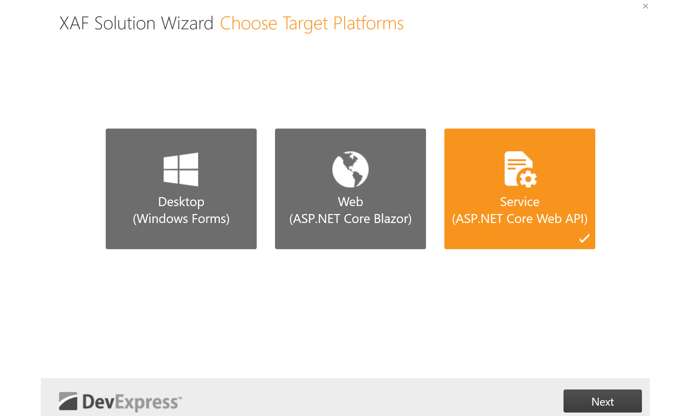
2. Choose Entity Framework as your ORM.
  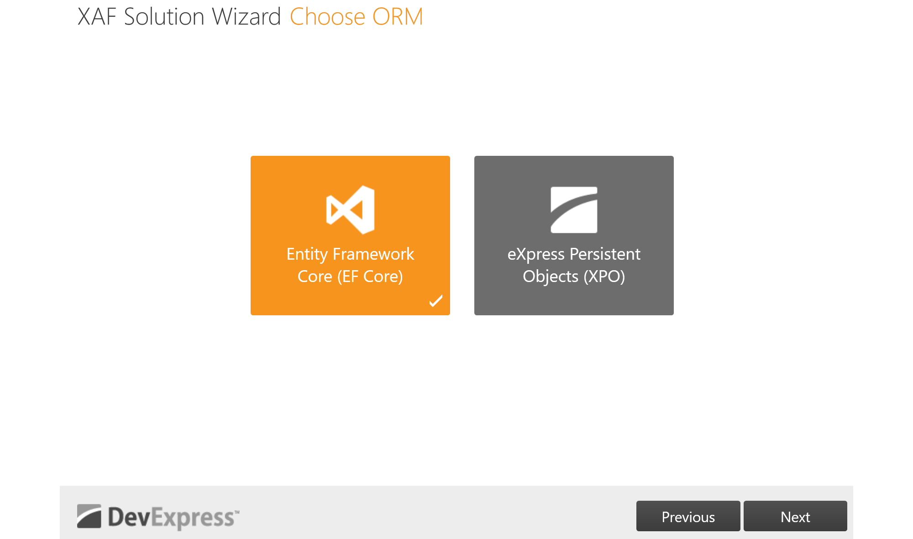
3. Choose Standard Authentication to generate the [JWT](https://en.wikipedia.org/wiki/JSON_Web_Token)  authentication scaffolding code.
   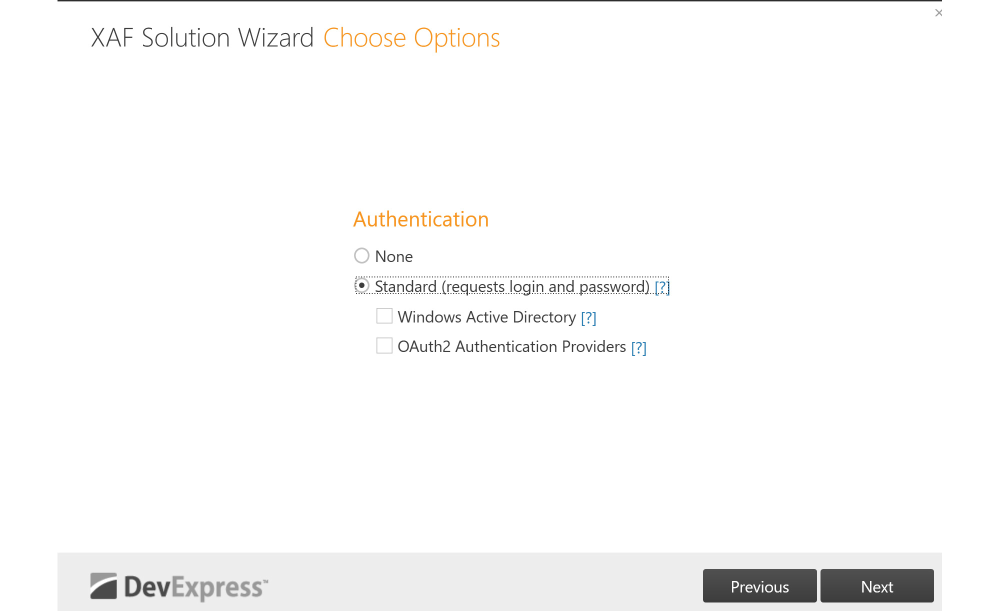
4. If you are using the [Universal Subscription](https://www.devexpress.com/subscriptions/universal.xml), the next page will allow you to select additional modules to add to your Web API service. Choose all available modules and click **Finish**.
  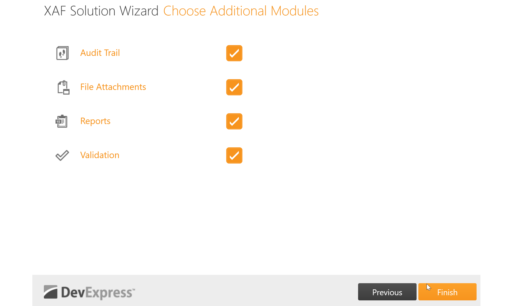
5. Modify the `WebAPI/Properties/launchSettings.json` file and remove the IIS Express profile to ensure that the `Kestrel server ports` will be utilized.

   ```json
   "IIS Express": {
      "commandName": "IISExpress",
      "launchBrowser": true,
      "launchUrl": "swagger",
      "environmentVariables": {
        "ASPNETCORE_ENVIRONMENT": "Development"
      }
   },
   ```

## Step 2. Declare a data model.

1. Declare the `Post` object.

   ```cs
   [VisibleInReports]
   public class Post : BaseObject {
      public virtual string Title { get; set; }
      public virtual string Content { get; set; }
      public virtual ApplicationUser Author { get; set; }
      public override void OnCreated() {
         base.OnCreated();
         Author = ObjectSpace.FindObject<ApplicationUser>(CriteriaOperator.Parse("ID=CurrentUserId()"));
      }
   }
   ```

   In the above code sample, the `Post` class inherits [BaseObject](https://docs.devexpress.com/eXpressAppFramework/DevExpress.Persistent.BaseImpl.BaseObject) to simplify data model implementation. In particular, this tutorial makes use of the following `BaseObject` class's features:

   - The pre-defined `Guid`-type primary key field (`ID`);
   - The `OnCreated` lifecycle method;
   - The `ObjectSpace` property, which allows you to communicate with the underlying data layer. See the [BaseObjectSpace](https://docs.devexpress.com/eXpressAppFramework/DevExpress.ExpressApp.BaseObjectSpace) documentation topic for more information.

3. Modify the Entity Framework DBContext with an additional DBSet.

   ```cs
   public DbSet<Post> Posts { get; set; }
   ```

2. Add a `Photo` property to the `User` object.

   ```cs
   public virtual MediaDataObject Photo { get; set; }
   ```

## Step 3. Set up a development database connection

The XAF Solution Wizard generates the connection string and startup code required to store persistent data in a [SQL Server Express LocalDB](https://learn.microsoft.com/en-us/sql/database-engine/configure-windows/sql-server-express-localdb) database, which is only available on Microsoft Windows. If you are planning to develop your Web API backend on a non-Windows machine, consider using [SQLite](https://www.sqlite.org/) instead.

To use SQLite, add the [Microsoft.EntityFrameworkCore.Sqlite](https://www.nuget.org/packages/Microsoft.EntityFrameworkCore.Sqlite) **v6** NuGet package to your project's dependencies. After that, add the following code to the `ConfigureServices` method within `startup.cs`:

```cs
public void ConfigureServices(IServiceCollection services) {
   // ...
   services.AddDbContextFactory<WebAPIEFCoreDbContext>((serviceProvider, options) => { 
      if (RuntimeInformation.IsOSPlatform(OSPlatform.Windows)) {
         string connectionString = Configuration.GetConnectionString("ConnectionString");
         options.UseSqlServer(connectionString);
      }
      else {
         string sqliteDBPath = Path.Join(Environment.GetFolderPath(Environment.SpecialFolder.LocalApplicationData), "WebAPIDemo.db");
         options.UseSqlite($"Data Source={sqliteDBPath}");
      }
      // ...
   }
}
```

## Step 4. Define the built-in and custom Web API endpoints.

1. Modify the Startup.cs to register the `built-in CRUD endpoints` for the Post object.

   ```cs
   services
	 .AddXafWebApi(Configuration, options => {
	 	// Make your business objects available in the Web API and generate the GET,  POST, PUT, and DELETE HTTP methods for it.
	 	// options.BusinessObject<YourBusinessObject>();
	 	options.BusinessObject<Post>();
	 });
   ```

2. Add a `CustomEndPointController` inside the `WebAPI/API` directory, injecting the `ISecurityProvider` and `IObjectSpaceFactory` to request user permissions and retrieve database data from the endpoints we will create later. 

   ```cs
     [ApiController]
     [Route("api/[controller]")]
     [Authorize]
     public class CustomEndPointController : ControllerBase {
         private readonly ISecurityProvider _securityProvider;
         private readonly IObjectSpaceFactory _securedObjectSpaceFactory;
 
 
         public CustomEndPointController(ISecurityProvider securityProvider,  IObjectSpaceFactory securedObjectSpaceFactory) {
             _securityProvider = securityProvider;
             _securedObjectSpaceFactory = securedObjectSpaceFactory;
         }
     }
   ```

   For more information on how to access underlying XAF APIs from a custom endpoint's implementation, refer to the following documentation article: [Access Object Space, Security System, Caption Helper, and XAF Modules in the ASP.NET Core Environment](https://docs.devexpress.com/eXpressAppFramework/403669/data-manipulation-and-business-logic/access-object-space-security-and-caption-helper-in-asp-net-core-environment).

3. Create the `CanCreate` endpoint, which will return if the user has permissions to create a specific business object.

   ```cs
     [HttpGet(nameof(CanCreate))]
     public IActionResult CanCreate(string typeName) {
         var strategy = (SecurityStrategy)_securityProvider.GetSecurity();
         var objectType = strategy.TypesInfo.PersistentTypes.First(info => info.Name  == typeName).Type;
         return Ok(strategy.CanCreate(objectType));
     }
   ```

4. Create the `AuthorPhoto` endpoint to return the author photo of a post from the database using the `_securedObjectSpaceFactory`. This ensures that the user's permissions are respected.

   ```cs
      [HttpGet("AuthorPhoto/{postId}")]
      public FileStreamResult AuthorPhoto(Guid postId) {
         using var objectSpace = _securedObjectSpaceFactory.CreateObjectSpace(typeof(Post));
         var post = objectSpace.GetObjectByKey<Post>(postId);
         var photoBytes = post.Author.Photo.MediaData;
         return File(new MemoryStream(photoBytes), "application/octet-stream");
      }
   ```

5. Create the `Archive` endpoint which will get Posts from the database, respecting always the system permissions with the __securedObjectSpaceFactory_ and archive them to disk.

   ```cs
      [HttpPost(nameof(Archive))]
      public async Task<IActionResult> Archive([FromBody] Post post) {
         using var objectSpace = _securedObjectSpaceFactory.CreateObjectSpace<Post>();
         post = objectSpace.GetObject(post);
         var photo = post.Author.Photo.MediaResource.MediaData;
         await System.IO.File.WriteAllTextAsync($"{post.ID}",
               JsonSerializer.Serialize(new { photo, post.Title, post.Content, post.Author.UserName }));
         return Ok();
      }
   ```

6. Create the `GetReport` endpoint which will redirect to build-in `DownloadByName` endpoint and will return a Report for the Post with title _Post Report_.

   ```cs
   [HttpGet(nameof(GetReport))]
   public RedirectResult GetReport() 
     => Redirect("~/api/report/DownloadByName(Post Report)");
   ```

## Step 5. Create the Editor and Viewer users along with Roles, permissions, photos and Post objects.

1. Modify the the `WebAPI.DatabaseUpdate.Updater` and add the next snippet inside the `UpdateDatabaseAfterUpdateSchema`:
   ```cs
     var editorUser = ObjectSpace.FirstOrDefault<ApplicationUser>(user=>user. UserName=="Editor")??ObjectSpace.CreateObject<ApplicationUser>();
     if (ObjectSpace.IsNewObject(editorUser)) {
         //create Editor User/Role
         editorUser.UserName="Editor";
 
         var editorRole = ObjectSpace.CreateObject<PermissionPolicyRole>();
         editorRole.Name = "EditorRole";
         editorUser.SetPassword("");
         editorRole.AddTypePermission<Post>(SecurityOperations.CRUDAccess,  SecurityPermissionState.Allow);
         editorRole.AddTypePermission<ApplicationUser>(SecurityOperations.CRUDAccess,  SecurityPermissionState.Allow);
 
         editorUser.Roles.Add(editorRole);
         editorUser.Roles.Add(defaultRole);
         editorUser.Photo = ObjectSpace.CreateObject<MediaDataObject>();
         editorUser.Photo.MediaData = GetResourceByName("Janete");
 
         //create Viewer User/Role
         var viewerUser = ObjectSpace.CreateObject<ApplicationUser>();
         viewerUser.UserName = "Viewer";
         viewerUser.SetPassword("");
         viewerUser.Photo = ObjectSpace.CreateObject<MediaDataObject>();
         viewerUser.Photo.MediaData = GetResourceByName("John");
         var viewerRole = ObjectSpace.CreateObject<PermissionPolicyRole>();
         viewerRole.Name = "ViewerRole";
         viewerRole.AddTypePermission<Post>(SecurityOperations.Read,  SecurityPermissionState.Allow);
         viewerRole.AddTypePermission<ApplicationUser>(SecurityOperations.Read,  SecurityPermissionState.Allow);
         viewerUser.Roles.Add(viewerRole);
         viewerUser.Roles.Add(defaultRole);
 
         //commit
         ObjectSpace.CommitChanges();
 
         //assign authentication type
         foreach (var user in new[] { editorUser, viewerUser }. Cast<ISecurityUserWithLoginInfo>()) {
             user.CreateUserLoginInfo(SecurityDefaults.PasswordAuthentication,
                 ObjectSpace.GetKeyValueAsString(user));
         }
 
         //sample posts
         var post = ObjectSpace.CreateObject<Post>();
         post.Title = "Hello World";
         post.Content = "This is a FREE API for everybody";
         post.Author=editorUser;
         post = ObjectSpace.CreateObject<Post>();
         post.Title = "Hello MAUI";
         post.Content = "Please smash the like button to help our videos get  discovered";
         post.Author=editorUser;
     }
   ```
   > **NOTE**
   >
   > In the example code, the `GetResourceByName` method returns a byte array representation of an account image based on its name. You can find an example implementation of this method in the WebAPI project's [_DatabaseUpdate/Updater.cs_](./WebApi/DatabaseUpdate/Updater.cs) file. Note that this implementation requires the image resources to be compiled into the application's assembly (the .jpg files' `Build Action` option must be set to `Embedded resource`).

2. Modify the _GetDefaultRole_ to add additional permissions for the `ReportsDataV2`, `MediaDataObject`, `MediaResourceObject`.

   ```cs
   defaultRole.AddTypePermissionsRecursively<ReportDataV2>(SecurityOperations. CRUDAccess, SecurityPermissionState.Allow);
   defaultRole.AddTypePermissionsRecursively<MediaDataObject>(SecurityOperations. CRUDAccess, SecurityPermissionState.Allow);
   defaultRole.AddTypePermissionsRecursively<MediaResourceObject>(SecurityOperations. CRUDAccess, SecurityPermissionState.Allow);
   ```


## Step 6. Create A Predefined Static Report to display the Post business objects.

The [XAF Reports module](https://docs.devexpress.com/eXpressAppFramework/113591/shape-export-print-data/reports/reports-v2-module-overview?p=netframework) is a [Universal Subscription](https://www.devexpress.com/subscriptions/universal.xml) feature that you can use to easily integrate [DevExpress Reports](https://www.devexpress.com/subscriptions/reporting/) into your backend Web API Service. Skip this step if you are using the Web API Service as a part of the _DevExpress .NET App Security Library_ & Web API Service free offer.

Follow the steps bellow to create and initialize a report:

1. Add the Report component using the Visual Studio New Item wizard.
2. Drag and drop a CollectionDataSource component from the Visual Studio toolbox and change its ObjectTypeName to `WebAPI.BusinessObjects.Post`.
3. Drag & drop all discovered fields from the Field List window onto the Report details surface.

   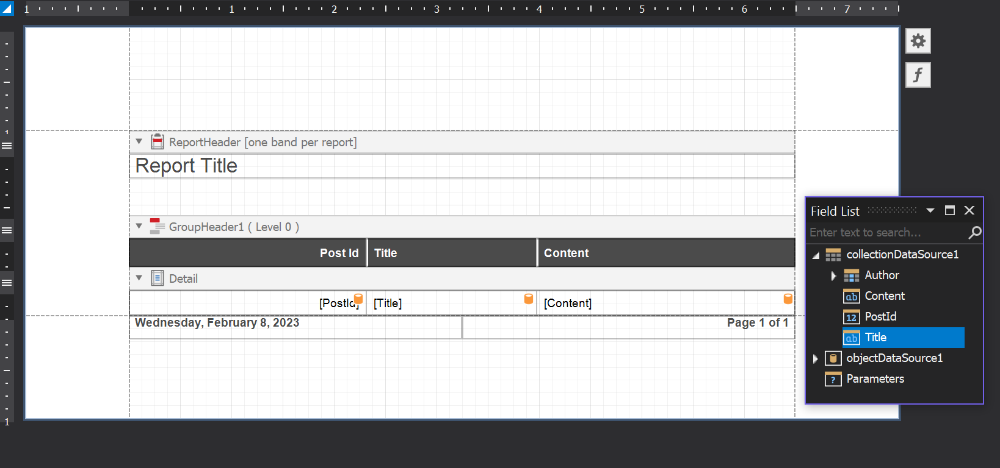 
4. Use a predefined reports updater to initialize the report (Module.cs).
   ```cs
   public override IEnumerable<ModuleUpdater> GetModuleUpdaters(IObjectSpace objectSpace, Version versionFromDB) {
        var predefinedReportsUpdater = new PredefinedReportsUpdater(Application, objectSpace, versionFromDB);
        predefinedReportsUpdater.AddPredefinedReport<XtraReport1>("Post Report",typeof(Post));
        return new ModuleUpdater[] { new DatabaseUpdate.Updater(objectSpace, versionFromDB),predefinedReportsUpdater };
    }
   ```
See the [Create a Report in Visual Studio](https://docs.devexpress.com/XtraReports/14989/get-started-with-devexpress-reporting/create-a-report-in-visual-studio#add-a-new-report) documentation topic for more information on creating and editing reports.

For more information on using predefined static report in XAF, see the [Create Predefined Static Reports](https://docs.devexpress.com/eXpressAppFramework/113645/shape-export-print-data/reports/create-predefined-static-reports) article.

Watch video: [Preview Reports as PDF in .NET MAUI Apps using Backend Web API Service Endpoints with EF Core](https://www.youtube.com/watch?v=bn4iF5Gc9XY)

## Step 7. Use the Swagger UI to test the Web API project custom and build-in endpoints. 

> **NOTE** 
>
>Using the Swagger interface and with the debugger attached, you must authenticate at least once to scaffold the database and initialize the data.

  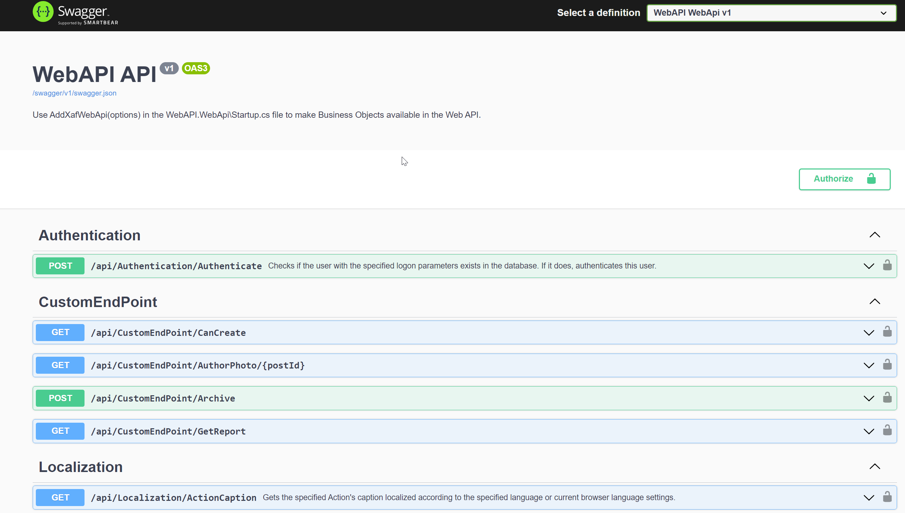 

See the [Test the Web API with Swagger or Postman](https://docs.devexpress.com/eXpressAppFramework/404281/backend-web-api-service/test-the-web-api-with-swagger-postman)  documentation article for more information.

## Step 8. Create the .NET MAUI project.

> **NOTE** 
>
> Debugging configurations for both iOS and Android can be complex, so it is not feasible to provide all possible scenarios. In this demo, we tested using Windows 10 with Visual Studio 2022. For iOS, we utilized the paired remote Mac method, and for Android, we utilized the built-in emulator..

> The .NET MAUI project does not have any dependencies to the XAF assemblies. However, for convenience, we will use the DevExpress .NET MAUI components and Wizard to scaffold the initial project.

1. Use the New Project Wizard. 
  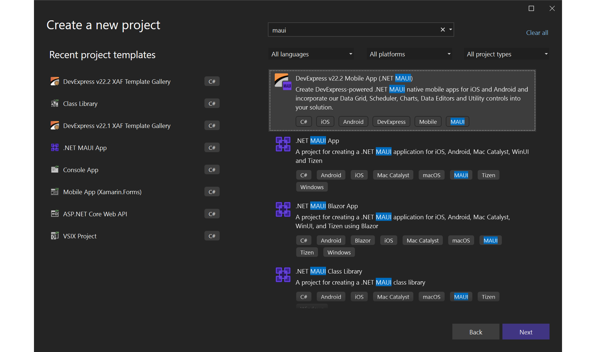
2. Choose both the `IOS & Android` platform, the `Tabbed` layout and the `Collection View`, the `Data Editors` and the `Data Forms`
  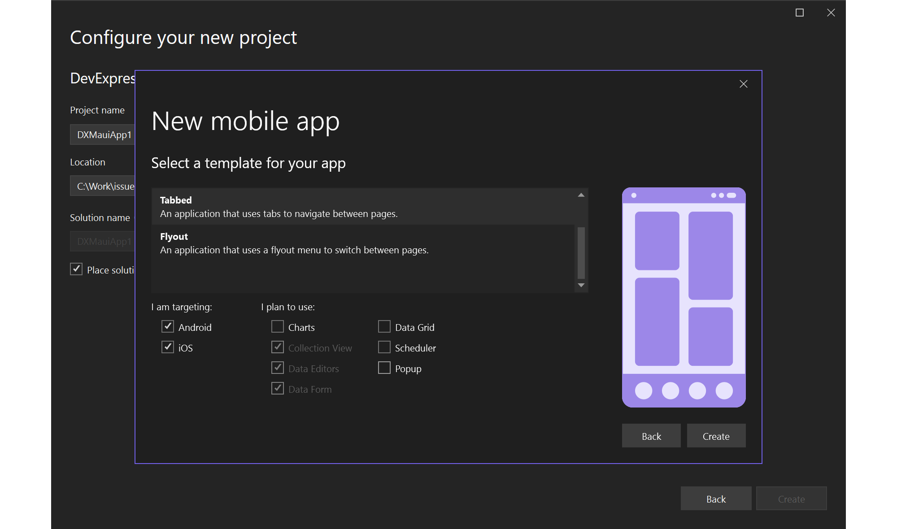

## Step 9. Clean-Refactor the wizard generated project.

1. Refactor the Model/Item.cs to Post, replace all project references.

   ```cs
   public class Post {
       public Guid ID { get; set; }
       public string Title { get; set; }
       public string Content { get; set; }    
   }
   ```
   
2. Modify the Platform/Android/AndroidManifest.xml assigning permissions for network access, file storage and document access.

   ```xml
     <?xml version="1.0" encoding="utf-8"?>
     <manifest xmlns:android="http://schemas.android.com/apk/res/android">
         <uses-sdk android:minSdkVersion="21" android:targetSdkVersion="33" />
         <application android:allowBackup="true" android:icon="@mipmap/appicon"  android:roundIcon="@mipmap/appicon_round" android:supportsRtl="true">
         <provider
         android:name="androidx.core.content.FileProvider"
         android:authorities="${applicationId}.provider"
         android:exported="false"
         android:grantUriPermissions="true">
         <meta-data
             android:name="android.support.FILE_PROVIDER_PATHS"
             android:resource="@xml/provider_paths" />
         </provider>
     </application>
         <uses-permission android:name="android.permission.ACCESS_NETWORK_STATE" />
     <uses-permission android:name="android.permission.WRITE_EXTERNAL_STORAGE" />
     <uses-permission android:name="android.permission.READ_EXTERNAL_STORAGE" />
     <uses-permission android:name="android.permission.MANAGE_DOCUMENTS" />
     </manifest>
   ```

3. Add the `AndroidMessageHandler` inside the Platform/Android folder.

   ```cs
     using MAUI.Platforms.Android;
     namespace MAUI.Platforms.Android {
         class AndroidMessageHandler : Xamarin.Android.Net.AndroidMessageHandler {
             public AndroidMessageHandler() 
                 => ServerCertificateCustomValidationCallback = (_, cert, _, errors) 
                     => cert is { Issuer: "CN=localhost" } || errors == System.Net. Security.SslPolicyErrors.None;
 
             protected override Javax.Net.Ssl.IHostnameVerifier GetSSLHostnameVerifier (Javax.Net.Ssl.HttpsURLConnection connection)
                 => new HostnameVerifier();
 
             private sealed class HostnameVerifier : Java.Lang.Object, Javax.Net.Ssl. IHostnameVerifier {
                 public bool Verify(string hostname, Javax.Net.Ssl.ISSLSession  session) 
                     => Javax.Net.Ssl.HttpsURLConnection.DefaultHostnameVerifier!. Verify(hostname, session) ||
                     hostname == "10.0.2.2" && session.PeerPrincipal?.Name ==  "CN=localhost";
             }
         }
     }
 
     namespace MAUI.Services {
         public static partial class HttpMessageHandler {
             static HttpMessageHandler() 
                 => PlatformHttpMessageHandler = new AndroidMessageHandler();
         }
     } 
   ```

4. Add the `IOSMessageHandler` inside the Platform/IOS folder.

   ```cs
   public static partial class HttpMessageHandler {
         static HttpMessageHandler() {
             NSUrlSessionHandler nSUrlSessionHandler = new();
             nSUrlSessionHandler.ServerCertificateCustomValidationCallback += (_,  cert, _, errors) 
                 => cert is { Issuer: "CN=localhost" } || errors == System.Net. Security.SslPolicyErrors.None;
             nSUrlSessionHandler.TrustOverrideForUrl = (sender, url, trust) => {
                 return true;
             };
             PlatformHttpMessageHandler = nSUrlSessionHandler;
	     }
     }
   ```

5. Refactor the Services/IDataStore.cs.

   ```cs
   public interface IDataStore<T> {
      Task<bool> AddItemAsync(T item);
      Task<T> GetItemAsync(string id);
      Task<IEnumerable<T>> GetItemsAsync(bool forceRefresh = false);
      Task<bool> UserCanCreatePostAsync();
      Task<byte[]> GetAuthorPhotoAsync(Guid postId);
      Task ArchivePostAsync(T post);
      Task ShapeIt();
      Task Authenticate(string userName,string password); 
   }
   ```

## Step 10. Bind the .NET MAUI pages with the IDataStore interface.

1. Register Routes and initial navigation in the `App.xaml.cs`.

   ```cs
   public App() {
	   InitializeComponent();
	   DependencyService.Register<NavigationService>();
	   DependencyService.Register<WebAPIService>();
 
	   Routing.RegisterRoute(typeof(ItemDetailPage).FullName, typeof(ItemDetailPage));
	   Routing.RegisterRoute(typeof(NewItemPage).FullName, typeof(NewItemPage));
	   Routing.RegisterRoute(typeof(ItemsPage).FullName, typeof(ItemsPage));
	 
	   MainPage = new MainPage();
	   var navigationService = DependencyService.Get<INavigationService>();
	   navigationService.NavigateToAsync<LoginViewModel>(true);
   }
   ```

2. Modify the `MainPage.xaml` layout to display the `Log In` page we previously navigate to.

   ```xml
   <TabBar>
	 <Tab Title ="Browse" Icon="browse">
	 	<ShellContent ContentTemplate="{DataTemplate views:ItemsPage}" />
	 </Tab>
	 <Tab Title="Logout" Icon="logout" Route="MAUI.Views.LoginPage">
	 	<ShellContent ContentTemplate="{DataTemplate views:LoginPage}" Route="MAUI.Views. LoginPage" />
	 </Tab>
   <TabBar>
   	<ShellContent ContentTemplate="{DataTemplate views:LoginPage}" Route="MAUI. Views.  LoginPage" />
   </TabBar>
   </TabBar>
   ```
3. Modify the `LoginViewModel` to authenticate and navigate to the Items page.

   ```cs
   async void OnLoginClicked() {
      IsAuthInProcess = true;
      var response = await ((WebAPIService)DataStore).Authenticate(userName, password);
      IsAuthInProcess = false;
      if (!string.IsNullOrEmpty(response)) {
            ErrorText = response;
            HasError = true;
            return;
      }
      HasError = false;
      await Navigation.NavigateToAsync<ItemsViewModel>();
   }

   ```
4. Add the `ShapeIt` ToolBarItem in the `ItemsPage.xaml`.

   ```cs
   <ToolbarItem Text="ShapeIt" Command="{Binding ShapeItCommand}"   />
   ```

5. Bind this command inside the `ItemsViewModel.cs`.

   ```cs
   public ItemsViewModel() {
	   ShapeItCommand = new Command(async () => await DataStore.ShapeIt());
   }
   public Command ShapeItCommand { get; }
   ``` 

6. Similarly, in the same file modify the `ExecuteLoadItemsCommand` to request all posts from the `IDataStore` service.

   ```cs
   async Task ExecuteLoadItemsCommand() {
      IsBusy = true;
      try
      {
         Items.Clear();
         var items = await DataStore.GetItemsAsync(true);
         foreach (var item in items) {
            Items.Add(item);
         }
      }
      catch (Exception ex) {
         System.Diagnostics.Debug.WriteLine(ex);
      }
      finally {
         IsBusy = false;
      }
   }  
   ```

7. Modify the `OnAddItem` method to disable creating a new `Post` if there are no permissions.

   ```cs
   async void OnAddItem(object obj) {
      if (await DataStore.UserCanCreatePostAsync()) {
         await Navigation.NavigateToAsync<NewItemViewModel>(null);
      }
      else {
         await Shell.Current.DisplayAlert("Error", "Access denied", "Ok");
      }
   }
   ``` 

8. Modify the `NewItemViewModel/OnSave` to save the new `Post`.

   ```cs
   async void OnSave() {
      await DataStore.AddItemAsync(new Post() {
         ID = Guid.NewGuid(),
         Title = Title,
         Content = Content
      });
      await Navigation.NavigateToAsync<ItemsViewModel>();
   }
   ```

9. Add an `ArchiveCommand` ToolBarItem in the `ItemsDetailPage.xaml`.

   ```xml
   <ToolbarItem Text="Archive" Command="{Binding ArchiveCommand}"></ToolbarItem>
   ```

10. Add an `Thumbnail` image inside the layout of the same page.

    ```xml
    <Label Text="Title:" FontFamily="Roboto" FontSize="12" TextColor="{StaticResource   NormalLightText}"/>
    <Label Text="{Binding Title}" FontFamily="Roboto" FontSize="14" TextColor="  {StaticResource NormalText}" Margin="0, 0, 0, 15"/>
    <Label Text="Content:" FontFamily="Roboto" FontSize="12" TextColor="  {StaticResource NormalLightText}" />
    <Label Text="{Binding Content}" FontFamily="Roboto" FontSize="14" TextColor="  {StaticResource NormalText}"/>
    <Label Text="Author:"></Label>
    <Image   Source="{Binding Thumbnail}"></Image>
    ```

11. Implement the `ArchiveCommand` in the `ItemDetailViewModel.cs`.

    ```cs
    public ItemDetailViewModel() => ArchiveCommand = new Command(OnArchive);
  
    private async void OnArchive(object obj) {
    	if (!await DataStore.UserCanCreatePostAsync()) {
    		await Shell.Current.DisplayAlert("Error", "Permission denied", "OK");
    	}
    	else {
    		await DataStore.ArchivePostAsync(Post);
    	}
    }
    
    public Command ArchiveCommand { get; }
    ```

12. Similarly in the same file add the `Thumbnail` implementation and get all other `Post` properties from the `IDataStore`.

   ```cs
   public ImageSource Thumbnail 
   => ImageSource.FromStream(() => new MemoryStream(_photoBytes));

   public async Task LoadItemId(string itemId) {
      try {
         _photoBytes = await DataStore.GetAuthorPhotoAsync(Guid.Parse(itemId));
         OnPropertyChanged(nameof(Thumbnail));
         Post = await DataStore.GetItemAsync(itemId);
         Id = Post.ID;
         Title = Post.Title;
         Content = Post.Content;
         
      }
      catch (Exception e) {
         System.Diagnostics.Debug.WriteLine($"Failed to Load Post {e}");
      }
   }

   ```
    
## Step 11. Implement the IDataStore methods inside the WebAPIService.cs

1. Add constants and read-only fields. Use the `On.Platform` syntax to declare iOS/Android debug URLs.

   ```cs
   public static partial class HttpMessageHandler {
      static readonly System.Net.Http.HttpMessageHandler PlatformHttpMessageHandler;
      public static System.Net.Http.HttpMessageHandler GetMessageHandler() =>       PlatformHttpMessageHandler;
   }
 
   public class WebAPIService:IDataStore<Post> {
      private static readonly HttpClient HttpClient = new(HttpMessageHandler.  GetMessageHandler());
      private readonly string _apiUrl = ON.Platform(android:"https://10.0.2.2:5001/api/  ", iOS:"https://localhost:5001/api/");
      private readonly string _postEndPointUrl;
      private const string ApplicationJson = "application/json";

      public WebAPIService() 
      => _postEndPointUrl = _apiUrl + "odata/" + nameof(Post);
   }
   ```  
   
   > **NOTE** 
   >
   > If you’re developing on a Windows PC and using a remote Mac to do the  build and run the simulator, localhost won’t resolve to the machine where you have your Web API Service hosted. Solutions to this case can be found online e.g. [Accessing ASP. NET Core API hosted on Kestrel over Https from iOS Simulator](https://nicksnettravels.builttoroam.com/post-2019-04-28-accessing-aspnet-core-api-hosted-on-kestrel-from-ios-simulator-android-emulator-and-uwp-applications-aspx/). Similarly, [you cannot access the Web API server when debugging the application using a real device (Android) connected through USB]( https://github.com/dotnet/maui/issues/8379). 


 
2. Implement the `Authenticate` method. 

   ```cs
   public async Task<string> Authenticate(string userName, string password) {
      var tokenResponse = await RequestTokenAsync(userName, password);
      var reposeContent = await tokenResponse.Content.ReadAsStringAsync();
      if (tokenResponse.IsSuccessStatusCode) {
      HttpClient.DefaultRequestHeaders.Authorization = new AuthenticationHeaderValue  ("Bearer", reposeContent);
      return string.Empty;
      }
      return reposeContent;
   }
 
   private async Task<HttpResponseMessage> RequestTokenAsync(string userName, string password) {
      try {
         return await HttpClient.PostAsync($"{_apiUrl}Authentication/Authenticate",
               new StringContent(JsonSerializer.Serialize(new { userName, password = $"{password}" }), Encoding.UTF8, ApplicationJson));
      }
      catch (Exception) {
         return new HttpResponseMessage(System.Net.HttpStatusCode.BadGateway) { Content = new StringContent("An error occurred during the processing of the request. Please consult the Demo's ReadMe file to discover potential causes and find solutions.") };
      }
   }
   ```

3. Start the Web API project, and then the .NET MAUI app, to test authentication on both iOS and Android platforms with both the Editor and Viewer users created in the Web API Module Updater.

  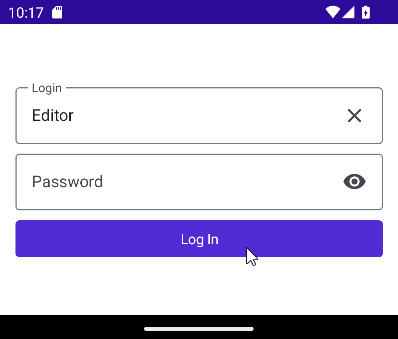
  
4. Implement the `GetItemsAsync` method to retrieve all posts from the Web API and test it as previously done.

   ```cs
   public async Task<IEnumerable<Post>> GetItemsAsync(bool forceRefresh = false) 
	 => await RequestItemsAsync();
 
   private async Task<IEnumerable<Post>> RequestItemsAsync(string query=null) 
	 => JsonNode.Parse(await HttpClient.GetStringAsync($"{_postEndPointUrl}{query}"))! ["value"].Deserialize<IEnumerable<Post>>();
   ```

   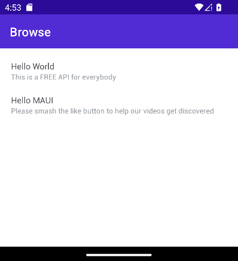 

5. Implement the `UserCanCreatePostAsync`.

   ```cs
   public async Task<bool> UserCanCreatePostAsync() 
	   => (bool)JsonNode.Parse(await HttpClient.GetStringAsync($"{_apiUrl}  CustomEndpoint/CanCreate?typename=Post"));
   ```

6. Implement `AddItemAsync` to create new posts. Test by clicking the "Add" button.

   ```cs
   public async Task<bool> AddItemAsync(Post post) {
      var httpResponseMessage = await HttpClient.PostAsync(_postEndPointUrl,
         new StringContent(JsonSerializer.Serialize(post), Encoding.UTF8, ApplicationJson) );
      if (!httpResponseMessage.IsSuccessStatusCode) {
         await Shell.Current.DisplayAlert("Error", await httpResponseMessage.Content. ReadAsStringAsync(), "OK");
      }
      return httpResponseMessage.IsSuccessStatusCode;
   }
   ```

     

7. Implement the `GetAuthorPhotoAsync`.

   ```cs
   public async Task<byte[]> GetAuthorPhotoAsync(Guid postId) 
	 	=> await HttpClient.GetByteArrayAsync($"{_apiUrl}CustomEndPoint/AuthorPhoto/ {postId}");
   ```
8. Implement the `GetItemAsync` method to display details of all posts and test by clicking on an item.

   ```cs
	 public async Task<Post> GetItemAsync(string id) 
	 	=> (await RequestItemsAsync($"?$filter={nameof(Post.ID)} eq {id}")).FirstOrDefault();
   ```

   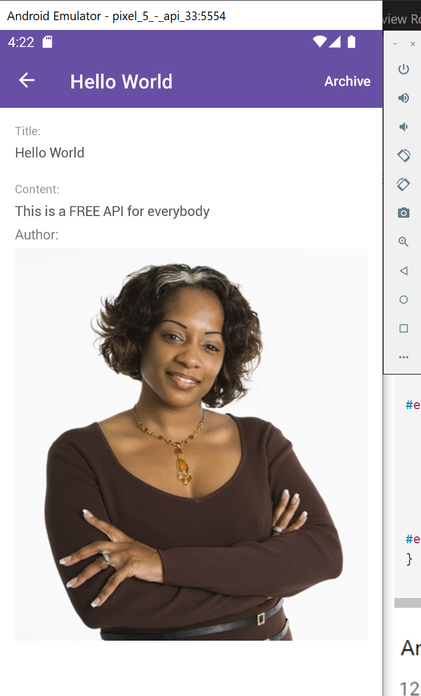
   
9. Implement the `Archive Post` method.

   ```cs
   public async Task ArchivePostAsync(Post post) {
        var httpResponseMessage = await HttpClient.PostAsync($"{_apiUrl}CustomEndPoint/Archive", new StringContent(JsonSerializer.Serialize(post), Encoding.UTF8, ApplicationJson));
        if (httpResponseMessage.IsSuccessStatusCode) {
            await Shell.Current.DisplayAlert("Success", "This post is saved to disk", "Ok");
        }
        else {
            await Shell.Current.DisplayAlert("Error", await httpResponseMessage.Content.ReadAsStringAsync(), "Ok");
        }
    }

   ```

   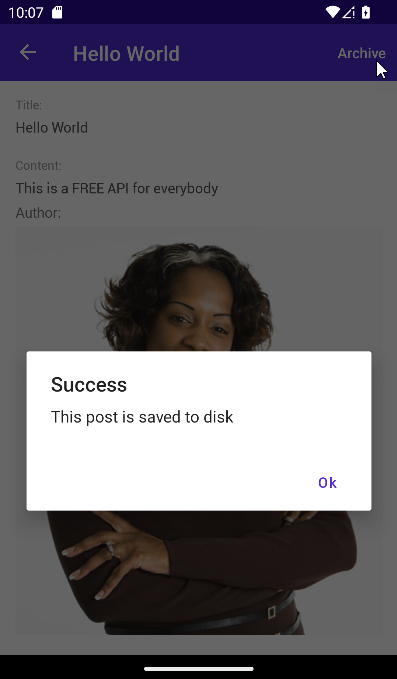
   
9. Implement the `ShapeIt` command to display the report.

   ```cs
   public async Task ShapeIt() {
   	var bytes = await HttpClient.GetByteArrayAsync($"{_apiUrl}report/DownloadByName   (Post Report)");
   #if ANDROID
   	var fileName = $"{FileSystem.Current.AppDataDirectory}/Report.pdf";
   	await File.WriteAllBytesAsync(fileName, bytes);
   	var intent = new Android.Content.Intent(Android.Content.Intent.ActionView);
   	intent.SetDataAndType(AndroidX.Core.Content.FileProvider.GetUriForFile(Android.App.   Application.Context,
   		$"{Android.App.Application.Context.ApplicationContext?.PackageName}.provider",   new Java.IO.File(fileName)),"application/pdf");
   	intent.SetFlags(Android.Content.ActivityFlags.ClearWhenTaskReset | Android.Content.   ActivityFlags.NewTask | Android.Content.ActivityFlags.GrantReadUriPermission);
   	Android.App.Application.Context.ApplicationContext?.StartActivity(intent);
   #else
   	var path = Environment.GetFolderPath (Environment.SpecialFolder.Personal);
   	var fileName = $"{path}/Report.pdf";
   	await File.WriteAllBytesAsync(fileName, bytes);
   	var filePath = Path.Combine(path, "Report.pdf");
   	var viewer = UIKit.UIDocumentInteractionController.FromUrl(Foundation.NSUrl.   FromFilename(filePath));
   	viewer.PresentOpenInMenu(new System.Drawing.RectangleF(0,-260,320,320),Platform.   GetCurrentUIViewController()!.View! , true);
   #endif
   }

   ``` 
   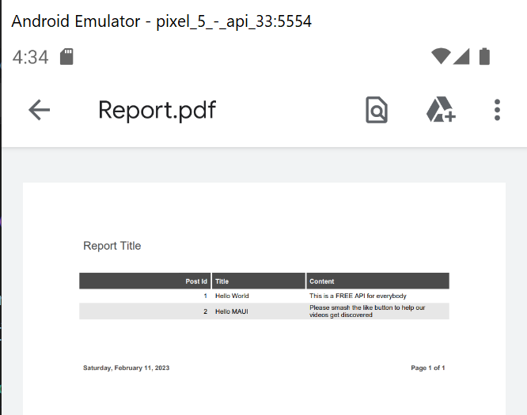

  