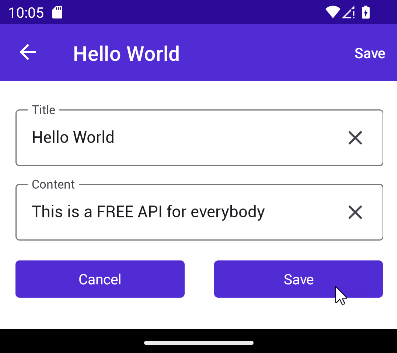

# How to Create a Web API Service Backend for a .NET MAUI Application

This example demonstrates how you can create a [Web API service](https://docs.devexpress.com/eXpressAppFramework/113366/concepts/security-system/security-system-overview) backend and a mobile .NET MAUI application frontend. The frontend app uses EF Core for data access.

The application works with blog post data. It authenticates a user, determines his or her permissions, and selectively enables the following data operations: 

- List existing Post records
- Display a photo of a Post author
- Create new Post records
- Archive a Post record
- Display a report based on Post records

## Prerequisites

- [Visual Studio 2022 v17.0+](https://visualstudio.microsoft.com/vs/)
- [.NET SDK 6.0+](https://dotnet.microsoft.com/download/dotnet-core)
- [DevExpress .NET MAUI Project Templates for Visual Studio 2022](https://marketplace.visualstudio.com/items?itemName=DevExpress.MauiVSTemplates2022)
- [DevExpress Libraries v22.2+](https://www.devexpress.com/Products/Try/). Download and run our **Unified Component Installer**. Make sure to enable the **Cross-Platform .NET App UI & Web API service (XAF)** option in the list of products to install. The installer will register local NuGet package sources and Visual Studio templates required for this tutorial. 

You don't have to use the **DevExpress Unified Component Installer** if you only want to run the example project or use the project as a boilerplate for your application. You can manually register your [NuGet feed URL](https://docs.devexpress.com/GeneralInformation/116042/installation/install-devexpress-controls-using-nuget-packages/obtain-your-nuget-feed-url) in Visual Studio as described in the following article: [Setup Visual Studio's NuGet Package Manager](https://docs.devexpress.com/GeneralInformation/116698/installation/install-devexpress-controls-using-nuget-packages/setup-visual-studios-nuget-package-manager).
  
  > **NOTE** 
  >
  > You may use a pre-release version of our components. For example, you may have obtained a hotfix from DevExpress. In such cases, NuGet packages will not be restored automatically and you need to update them manually as described in the [Updating Packages](https://docs.devexpress.com/GeneralInformation/118420/Installation/Install-DevExpress-Controls-Using-NuGet-Packages/Updating-Packages) article. Enable the [Include prerelease](https://docs.microsoft.com/en-us/nuget/create-packages/prerelease-packages#installing-and-updating-pre-release-packages) option.

## Build and Test a Basic Web API Service App (Backend)

### Create a Web API project using the XAF Solution Wizard

1. In Visual Studio, create a new project. Use the DevExpress XAF Template Gallery template. Enter project information and start the Wizard. On the first page, select only one tile: **Service (ASP.NET Core Web API)**.

  

2. Choose Entity Framework as your ORM.

  

3. Choose **Standard Authentication** to generate the [JWT](https://en.wikipedia.org/wiki/JSON_Web_Token) authentication scaffolding code.

  

4. If you own a license to the DevExpress [Universal Subscription](https://www.devexpress.com/subscriptions/universal.xml), the next page allows you to select additional modules to add to your Web API Service. Make sure to select **Reports** as this module is required to complete the tutorial (last step). You can choose other modules if you plan to extend the application. Click **Finish**.

  
  
5. Modify the `WebAPI/Properties/launchSettings.json` file and remove the IIS Express profile to ensure that the `Kestrel server ports` will be utilized. After that, the file's `"profiles"` section should look as shown below:

   _Properties/launchSettings.json_:
   ```json
   "profiles": {
      "WebAPI.WebApi": {
         "commandName": "Project",
         "dotnetRunMessages": "true",
         "launchBrowser": true,
         "launchUrl": "swagger",
         "applicationUrl": "https://localhost:5001;http://localhost:5000",
         "environmentVariables": {
         "ASPNETCORE_ENVIRONMENT": "Development"
         }
      }
   }
   }
   ```

See the following article for additional information: [Create a Standalone Web API Application](https://docs.devexpress.com/eXpressAppFramework/403401/backend-web-api-service/create-new-application-with-web-api-service).

### Declare a data model

1. Declare the `Post` object.

   _BusinessObjects/Post.cs_
   ```cs
   [VisibleInReports]
   public class Post : BaseObject {
      public virtual string Title { get; set; }
      public virtual string Content { get; set; }
      public virtual ApplicationUser Author { get; set; }
      public override void OnCreated() {
         base.OnCreated();
         Author = ObjectSpace.FindObject<ApplicationUser>(CriteriaOperator.Parse("ID=CurrentUserId()"));
      }
   }
   ```

   In the above code sample, the `Post` class inherits [BaseObject](https://docs.devexpress.com/eXpressAppFramework/DevExpress.Persistent.BaseImpl.BaseObject) to simplify data model implementation. This tutorial makes use of the following `BaseObject` features:

   - The predefined `Guid`-type primary key field (`ID`)
   - The `OnCreated` lifecycle method
   - The `ObjectSpace` property that allows you to communicate with the underlying data layer 
   
   See the [BaseObjectSpace](https://docs.devexpress.com/eXpressAppFramework/DevExpress.ExpressApp.BaseObjectSpace) documentation topic for more information.

2. Modify the Entity Framework DBContext with an additional DbSet.

   _BusinessObjects\WebAPIDbContext.cs_:
   ```cs
   public DbSet<Post> Posts { get; set; }
   ```

3. Modify the `Startup.cs` file to register the `built-in CRUD endpoints` for the Post object.

   _Startup.cs_:
   ```cs
   services
	 .AddXafWebApi(Configuration, options => {
	 	// Make your business objects available in the Web API and generate the GET, POST, PUT, and DELETE HTTP methods for it.
	 	// options.BusinessObject<YourBusinessObject>();
	 	options.BusinessObject<Post>();
	 });
   ```

### Set up a development database connection

The XAF Solution Wizard generates the connection string and startup code required to store persistent data in a [SQL Server Express LocalDB](https://learn.microsoft.com/en-us/sql/database-engine/configure-windows/sql-server-express-localdb) database, which is only available on Microsoft Windows. If you are planning to develop your Web API backend on a non-Windows machine, consider using [SQLite](https://www.sqlite.org/) instead.

To use SQLite, add the [Microsoft.EntityFrameworkCore.Sqlite](https://www.nuget.org/packages/Microsoft.EntityFrameworkCore.Sqlite) **v6** NuGet package to your project's dependencies. After that, add the following code to the `ConfigureServices` method within `Startup.cs`:

_Startup.cs_:
```cs
public void ConfigureServices(IServiceCollection services) {
   // ...
   services.AddDbContextFactory<WebAPIEFCoreDbContext>((serviceProvider, options) => { 
      if (RuntimeInformation.IsOSPlatform(OSPlatform.Windows)) {
         string connectionString = Configuration.GetConnectionString("ConnectionString");
         options.UseSqlServer(connectionString);
      }
      else {
         string sqliteDBPath = Path.Join(Environment.GetFolderPath(Environment.SpecialFolder.LocalApplicationData), "WebAPIDemo.db");
         options.UseSqlite($"Data Source={sqliteDBPath}");
      }
      // ...
   }
}
```

### Generate initial data

1. Open the `WebAPI/DatabaseUpdate/Updater.cs` file and add the following code to the `UpdateDatabaseAfterUpdateSchema` method to create the Editor and Viewer users, assign roles and permissions to them, and create sample Post objects:

   _DatabaseUpdate\Updater.cs_:
   ```cs
     var editorUser = ObjectSpace.FirstOrDefault<ApplicationUser>(user=>user. UserName=="Editor")??ObjectSpace.CreateObject<ApplicationUser>();
     if (ObjectSpace.IsNewObject(editorUser)) {
         //create Editor User/Role
         editorUser.UserName="Editor";
 
         var editorRole = ObjectSpace.CreateObject<PermissionPolicyRole>();
         editorRole.Name = "EditorRole";
         editorUser.SetPassword("");
         editorRole.AddTypePermission<Post>(SecurityOperations.CRUDAccess,  SecurityPermissionState.Allow);
         editorRole.AddTypePermission<ApplicationUser>(SecurityOperations.CRUDAccess,  SecurityPermissionState.Allow);
 
         editorUser.Roles.Add(editorRole);
         editorUser.Roles.Add(defaultRole);

         //create Viewer User/Role
         var viewerUser = ObjectSpace.CreateObject<ApplicationUser>();
         viewerUser.UserName = "Viewer";
         var viewerRole = ObjectSpace.CreateObject<PermissionPolicyRole>();
         viewerRole.Name = "ViewerRole";
         viewerRole.AddTypePermission<Post>(SecurityOperations.Read,  SecurityPermissionState.Allow);
         viewerRole.AddTypePermission<ApplicationUser>(SecurityOperations.Read,  SecurityPermissionState.Allow);
         viewerUser.Roles.Add(viewerRole);
         viewerUser.Roles.Add(defaultRole);
 
         //commit
         ObjectSpace.CommitChanges();
 
         //assign authentication type
         foreach (var user in new[] { editorUser, viewerUser }. Cast<ISecurityUserWithLoginInfo>()) {
             user.CreateUserLoginInfo(SecurityDefaults.PasswordAuthentication,
                 ObjectSpace.GetKeyValueAsString(user));
         }
 
         //sample posts
         var post = ObjectSpace.CreateObject<Post>();
         post.Title = "Hello World";
         post.Content = "This is a FREE API for everybody";
         post.Author=editorUser;
         post = ObjectSpace.CreateObject<Post>();
         post.Title = "Hello MAUI";
         post.Content = "Please smash the like button to help our videos get  discovered";
         post.Author=editorUser;
     }
   ```

### Use Swagger UI to test the Web API service

At this point, you can already run your Web API service and use the Swagger interface to authenticate as one of the previously defined users and test the generated endpoints (for example, query the available posts). See the following article for additional information: [Test the Web API with Swagger or Postman](https://docs.devexpress.com/eXpressAppFramework/404281/backend-web-api-service/test-the-web-api-with-swagger-postman).


## Build and test a basic .NET MAUI app (Frontend)

### Create a .NET MAUI project

> **NOTE** 
>
> Debugging configurations for both iOS and Android can be complex, so it is not feasible to provide all possible scenarios. We tested the app on Windows 10 with Visual Studio 2022. For iOS tests, we paired a remote Mac. For Android tests, we utilized the built-in emulator.

1. Open the _Create a new project_ window in Visual Studio. Select the DevExpress .NET MAUI option and start the wizard.

  

2. Choose both the _iOS & Android_ platforms, the _Tabbed_ layout, and the following controls: _Collection View_, _Data Editors_, and _Data Forms_.

  

### Modify platform-specific settings
   
1. In the `Platform/Android/AndroidManifest.xml` file, add the code below to set up the file provider, which is required for the application to store downloaded reports:

   _Platform/Android/AndroidManifest.xml_:
   ```xml
     <?xml version="1.0" encoding="utf-8"?>
     <manifest xmlns:android="http://schemas.android.com/apk/res/android">
         <uses-sdk android:minSdkVersion="21" android:targetSdkVersion="33" />
         <application android:allowBackup="true" android:icon="@mipmap/appicon"  android:roundIcon="@mipmap/appicon_round" android:supportsRtl="true">
         <provider
         android:name="androidx.core.content.FileProvider"
         android:authorities="${applicationId}.provider"
         android:exported="false"
         android:grantUriPermissions="true">
         <meta-data
             android:name="android.support.FILE_PROVIDER_PATHS"
             android:resource="@xml/provider_paths" />
         </provider>
     </application>
     <!-- ... --> 
     </manifest>
   ```

2. Add an `AndroidMessageHandler` class definition to `Platform/Android/AndroidMessageHandler.cs`. You will use this class to create an HTTP Client object that exchanges messages with the backend.

   _Platform/Android/AndroidMessageHandler.cs:
   ```cs
   using MAUI.Platforms.Android;
   namespace MAUI.Platforms.Android {
      class AndroidMessageHandler : Xamarin.Android.Net.AndroidMessageHandler {
            public AndroidMessageHandler() 
               => ServerCertificateCustomValidationCallback = (_, cert, _, errors) 
                  => cert is { Issuer: "CN=localhost" } || errors == System.Net. Security.SslPolicyErrors.None;

            protected override Javax.Net.Ssl.IHostnameVerifier GetSSLHostnameVerifier (Javax.Net.Ssl.HttpsURLConnection connection)
               => new HostnameVerifier();

            private sealed class HostnameVerifier : Java.Lang.Object, Javax.Net.Ssl. IHostnameVerifier {
               public bool Verify(string hostname, Javax.Net.Ssl.ISSLSession  session) 
                  => Javax.Net.Ssl.HttpsURLConnection.DefaultHostnameVerifier!. Verify(hostname, session) ||
                  hostname == "10.0.2.2" && session.PeerPrincipal?.Name ==  "CN=localhost";
            }
      }
   }

   namespace MAUI.Services {
      public static partial class HttpMessageHandler {
            static HttpMessageHandler() 
               => PlatformHttpMessageHandler = new AndroidMessageHandler();
      }
   } 
   ```

3. The same functionality for iOS applications is also required. Create an `IOSMessageHandler` class in the `Platform/IOS` folder.

   _Platform/IOS/IOSMessageHandler.cs_:
   ```cs
   public static partial class HttpMessageHandler {
         static HttpMessageHandler() {
             NSUrlSessionHandler nSUrlSessionHandler = new();
             nSUrlSessionHandler.ServerCertificateCustomValidationCallback += (_,  cert, _, errors) 
                 => cert is { Issuer: "CN=localhost" } || errors == System.Net. Security.SslPolicyErrors.None;
             nSUrlSessionHandler.TrustOverrideForUrl = (sender, url, trust) => {
                 return true;
             };
             PlatformHttpMessageHandler = nSUrlSessionHandler;
	     }
     }
   ```

### Define the application's data model
   
1. Add a definition for the `Post` class in the `Model/Post.cs` file.

   _Model/Post.cs_:
   ```cs
   public class Post {
       [JsonIgnore(Condition = JsonIgnoreCondition.WhenWritingDefault)]
       public Guid ID { get; set; }
       public string Title { get; set; }
       public string Content { get; set; }    
   }
   ```

2. Refactor the `IDataStore` interface in `Services/IDataStore.cs` so it declares a `GetItemsAsync` method used to obtain the list of existing posts.

   _Services/IDataStore.cs_:
   ```cs
   public interface IDataStore<T> {
      Task<IEnumerable<T>> GetItemsAsync(bool forceRefresh = false);
   }
   ```

3. Configure the `BaseViewModel` to use the data store:

   _ViewModels/BaseViewModel.cs_:
   ```cs
   public class BaseViewModel : INotifyPropertyChanged {
       public IDataStore<Post> DataStore => DependencyService.Get<IDataStore<Post>>();
       // ...
   }
   ```

4. Add a `WebAPIService` class to the project (the `Services/WebAPIService.cs` file). In this class, implement the `IDataStore` interface and the `Authenticate` method. In the code, send HTTP requests to your Web API service to authenticate and obtain data as shown below:

   _Services/WebAPIService.cs_:
   ```cs
   public static partial class HttpMessageHandler {
      static readonly System.Net.Http.HttpMessageHandler PlatformHttpMessageHandler;
      public static System.Net.Http.HttpMessageHandler GetMessageHandler() => PlatformHttpMessageHandler;
   }

   public class WebAPIService : IDataStore<Post> {
      private static readonly HttpClient HttpClient = new(HttpMessageHandler.GetMessageHandler()) { Timeout = new TimeSpan(0, 0, 10) };
      private readonly string _apiUrl = ON.Platform(android: "https://10.0.2.2:5001/api/", iOS: "https://localhost:5001/api/");
      private readonly string _postEndPointUrl;
      private const string ApplicationJson = "application/json";

      public WebAPIService()
         => _postEndPointUrl = _apiUrl + "odata/" + nameof(Post);

      public async Task<IEnumerable<Post>> GetItemsAsync(bool forceRefresh = false)
         => await RequestItemsAsync();

      private async Task<IEnumerable<Post>> RequestItemsAsync(string query = null)
         => JsonNode.Parse(await HttpClient.GetStringAsync($"{_postEndPointUrl}{query}"))!["value"].Deserialize<IEnumerable<Post>>();

      public async Task<string> Authenticate(string userName, string password) {
         var tokenResponse = await RequestTokenAsync(userName, password);
         var reposeContent = await tokenResponse.Content.ReadAsStringAsync();
         if (tokenResponse.IsSuccessStatusCode) {
               HttpClient.DefaultRequestHeaders.Authorization = new AuthenticationHeaderValue("Bearer", reposeContent);
               return string.Empty;
         }
         return reposeContent;
      }

      private async Task<HttpResponseMessage> RequestTokenAsync(string userName, string password) {
         try {
               return await HttpClient.PostAsync($"{_apiUrl}Authentication/Authenticate",
                     new StringContent(JsonSerializer.Serialize(new { userName, password = $"{password}" }), Encoding.UTF8, ApplicationJson));
         }
         catch (Exception) {
               return new HttpResponseMessage(System.Net.HttpStatusCode.BadGateway) { Content = new StringContent("An error occurred during the processing of the request. Please consult the demo's ReadMe file (Step 1,10) to discover potential causes and find solutions.") };
         }
      }

   }
   ```

   > **NOTE** 
   >
   > If you are developing on a Windows PC and using a remote Mac to do the build and run the simulator, localhost will not resolve to the machine where you host your Web API service. Multiple solution guides are available online. For example, you may find the following article helpful: [Accessing ASP.NET Core API hosted on Kestrel over Https from iOS Simulator, Android Emulator and UWP Applications.](https://nicksnettravels.builttoroam.com/post-2019-04-28-accessing-aspnet-core-api-hosted-on-kestrel-from-ios-simulator-android-emulator-and-uwp-applications-aspx/)
   >   
   > You may experience a similar problem with your Android project. Review the following GitHub issue: [Cannot access the Web API server when debugging the application using a real device (Android) connected through USB]( https://github.com/dotnet/maui/issues/8379). 

### Implement and test first views: "Login" and "Item List"

1. Register the `WebAPIService`, routes, and initial navigation in `App.xaml.cs`.

   _App.xaml.cs_:
   ```cs
   public App() {
      InitializeComponent();
      DependencyService.Register<NavigationService>();
      DependencyService.Register<WebAPIService>();

      Routing.RegisterRoute(typeof(ItemsPage).FullName, typeof(ItemsPage));
   
      MainPage = new MainPage();
      var navigationService = DependencyService.Get<INavigationService>();
      navigationService.NavigateToAsync<LoginViewModel>(true);
   }
   ```

2. Modify the `LoginViewModel` to authenticate in the Web API service and navigate to the Items page after successful authentication.

   _ViewModels/LoginViewModel.cs_:
   ```cs
   async void OnLoginClicked() {
      IsAuthInProcess = true;
      var response = await ((WebAPIService)DataStore).Authenticate(userName, password);
      IsAuthInProcess = false;
      if (!string.IsNullOrEmpty(response)) {
          ErrorText = response;
          HasError = true;
          return;
      }
      HasError = false;
      await Navigation.NavigateToAsync<ItemsViewModel>();
   }

   ```

3. In the `ItemsViewModel`, modify the `ExecuteLoadItemsCommand` to request all posts from the `IDataStore` service.

   _ViewModels/ItemsViewModel.cs_:
   ```cs
   async Task ExecuteLoadItemsCommand() {
      IsBusy = true;
      try
      {
         Items.Clear();
         var items = await DataStore.GetItemsAsync(true);
         foreach (var item in items) {
            Items.Add(item);
         }
      }
      catch (Exception ex) {
         System.Diagnostics.Debug.WriteLine(ex);
      }
      finally {
         IsBusy = false;
      }
   }  
   ```

Start the Web API project, and then the .NET MAUI app. Log in as an Editor or Viewer user created in the Web API Module Updater.


After you log in, you will see the predefined posts displayed in a list view.


## Extend Backend and Frontend Apps

### Add an "Item Details" view

1. Implement a Web API service endpoint that serves the author's photo based on the post's ID. 

   First, add the `Photo` property to the `ApplicationUser` persistent class:

   _BusinessObjects/ApplicationUser.cs_:
   ```cs
   public class ApplicationUser : PermissionPolicyUser, ISecurityUserWithLoginInfo {
      // ...
      public virtual MediaDataObject Photo { get; set; }
   }
   ```

   Modify the Module Updater. Add logic that assigns photos to predefined users:

   _DatabaseUpdate\Updater.cs_:
   ```cs
   // ...
   editorUser.Photo = ObjectSpace.CreateObject<MediaDataObject>();
   editorUser.Photo.MediaData = GetResourceByName("Janete");
   viewerUser.Photo = ObjectSpace.CreateObject<MediaDataObject>();
   viewerUser.Photo.MediaData = GetResourceByName("John");
   // ...
   ```

   > **NOTE**
   >
   > In the example code, the `GetResourceByName` method returns a byte array representation of an account image based on its name. You can find an example implementation of this method in the Web API project's [_DatabaseUpdate/Updater.cs_](./WebApi/DatabaseUpdate/Updater.cs) file. Note that this implementation requires the image resources to be compiled into the application's assembly (the .jpg files' `Build Action` option must be set to `Embedded resource`).

   Add a `CustomEndPointController` inside the `WebAPI/API` directory, and inject the `ISecurityProvider` and `IObjectSpaceFactory`. Implement a controller action that serves post author photos as shown below.

   _API/CustomEndPointController.cs_:
   ```cs
   [ApiController]
   [Route("api/[controller]")]
   [Authorize]
   public class CustomEndPointController : ControllerBase {
      private readonly ISecurityProvider _securityProvider;
      private readonly IObjectSpaceFactory _securedObjectSpaceFactory;

      public CustomEndPointController(ISecurityProvider securityProvider, IObjectSpaceFactory securedObjectSpaceFactory) {
         _securityProvider = securityProvider;
         _securedObjectSpaceFactory = securedObjectSpaceFactory;
      }

      [HttpGet("AuthorPhoto/{postId}")]
      public FileStreamResult AuthorPhoto(Guid postId) {
         using var objectSpace = _securedObjectSpaceFactory.CreateObjectSpace(typeof(Post));
         var post = objectSpace.GetObjectByKey<Post>(postId);
         var photoBytes = post.Author.Photo.MediaData;
         return File(new MemoryStream(photoBytes), "application/octet-stream");
      }  
   }
   ```

2. In the .NET MAUI project, update the data service with methods that request post details as well as the author's photo. 

   _Services/IDataStore.cs_:

   ```cs
   public interface IDataStore<T> {
       // ...
       Task<T> GetItemAsync(string id);
       Task<byte[]> GetAuthorPhotoAsync(Guid postId);
   }
   ```

   _Services/WebAPIService.cs_:
   
   ```cs
   public class WebAPIService : IDataStore<Post> {
      // ...
      public async Task<Post> GetItemAsync(string id)
        => (await RequestItemsAsync($"?$filter={nameof(Post.ID)} eq {id}")).FirstOrDefault();
      public async Task<byte[]> GetAuthorPhotoAsync(Guid postId)
          => await HttpClient.GetByteArrayAsync($"{_apiUrl}CustomEndPoint/AuthorPhoto/{postId}");
   }
   ```

3. Implement logic required to display the detail view when a user taps a post in the list.

   _ViewModels/ItemDetailViewModel.cs_:

   ```cs
   public ImageSource Thumbnail 
   => ImageSource.FromStream(() => new MemoryStream(_photoBytes));

   public async Task LoadItemId(string itemId) {
      try {
         _photoBytes = await DataStore.GetAuthorPhotoAsync(Guid.Parse(itemId));
         OnPropertyChanged(nameof(Thumbnail));
         Post = await DataStore.GetItemAsync(itemId);
         Id = Post.ID;
         Title = Post.Title;
         Content = Post.Content;
         
      }
      catch (Exception e) {
         System.Diagnostics.Debug.WriteLine($"Failed to Load Post {e}");
      }
   }
   ```

   _ViewModels/ItemsViewModel.cs_:

   ```cs
    public class ItemsViewModel : BaseViewModel {
        Post _selectedPost;

        public ItemsViewModel() {
            // ...
            ItemTapped = new Command<Post>(OnItemSelected);
        }

        public Command<Post> ItemTapped { get; }

        public Post SelectedPost {
            get => _selectedPost;
            set {
                SetProperty(ref _selectedPost, value);
                OnItemSelected(value);
            }
        }

        async void OnItemSelected(Post post) {
            if (post != null) await Navigation.NavigateToAsync<ItemDetailViewModel>(post.ID);
        }
        // ...
    }
   ```

   _App.xaml.cs_:

   ```cs
   public App() {
      // ...
      Routing.RegisterRoute(typeof(ItemDetailPage).FullName, typeof(ItemDetailPage));
      // ...
   }
   ```
   
   _Views/ItemDetailPage.xaml_:

   ```xml
   <StackLayout Spacing="5" Padding="15">
      <Label Text="Title:" FontFamily="Roboto" FontSize="12" TextColor="{StaticResource NormalLightText}"/>
      <Label Text="{Binding Title}" FontFamily="Roboto" FontSize="14" TextColor="{StaticResource NormalText}" Margin="0, 0, 0, 15"/>
      <Label Text="Content:" FontFamily="Roboto" FontSize="12" TextColor="{StaticResource NormalLightText}" />
      <Label Text="{Binding Content}" FontFamily="Roboto" FontSize="14" TextColor="{StaticResource NormalText}"/>
      <Label Text="Author:"></Label>
      <Image   Source="{Binding Thumbnail}"></Image>
   </StackLayout>
   ```


### Add a "New Item" entry form

1. The Web API Service automatically generates OData endpoints required to create business objects. However, the example application's security system is configured to disallow post creation for some users. You want to check permissions before a user can try and submit a post. For this purpose, implement a custom `CanCreate` endpoint.

   _API/CustomEndPointController.cs_:
   ```cs
   [HttpGet(nameof(CanCreate))]
   public IActionResult CanCreate(string typeName) {
       var strategy = (SecurityStrategy)_securityProvider.GetSecurity();
       var objectType = strategy.TypesInfo.PersistentTypes.First(info => info.Name  == typeName).Type;
       return Ok(strategy.CanCreate(objectType));
   }
   ```

2. Add new methods to the .NET MAUI application's data service: one will check user permissions, another will submit a new post.

   _Services/IDataStore.cs_:

   ```cs
   public interface IDataStore<T> {
       // ...
       Task<bool> UserCanCreatePostAsync();
       Task<T> AddItemAsync(Post post);
   }
   ```

   _Services/WebAPIService.cs_:
   
   ```cs
   public class WebAPIService : IDataStore<Post> {
      // ...
       public async Task<bool> UserCanCreatePostAsync() 
	        => (bool)JsonNode.Parse(await HttpClient.GetStringAsync($"{_apiUrl}  CustomEndpoint/CanCreate?typename=Post"));

       public async Task<bool> AddItemAsync(Post post) {
           var httpResponseMessage = await HttpClient.PostAsync(_postEndPointUrl,
               new StringContent(JsonSerializer.Serialize(post), Encoding.UTF8, ApplicationJson));
           if (!httpResponseMessage.IsSuccessStatusCode) {
               await Shell.Current.DisplayAlert("Error", await httpResponseMessage.Content.ReadAsStringAsync(), "OK");
           }
           return httpResponseMessage.IsSuccessStatusCode;
       }
   }
   ```

3. Configure the views and navigation:

   _ViewModels/ItemsViewModel.cs_:

   ```cs
   public class ItemsViewModel : BaseViewModel {
      public ItemsViewModel() {
         // ...
         AddItemCommand = new Command(OnAddItem);
      }
      public Command AddItemCommand { get; }

      async void OnAddItem(object obj) {
         if (await DataStore.UserCanCreatePostAsync()) {
               await Navigation.NavigateToAsync<NewItemViewModel>(null);
         }
         else {
               await Shell.Current.DisplayAlert("Error", "Access denied", "Ok");
         }
      }
   }
   ```

   _App.xaml.cs_:

   ```cs
   public App() {
      // ...
      Routing.RegisterRoute(typeof(NewItemPage).FullName, typeof(NewItemPage));
      // ...
   }
   ```


   _Views/ItemsPage.xaml_:

   ```xml
   <ContentPage.ToolbarItems >
       <ToolbarItem Text="Add" Command="{Binding AddItemCommand}" />
   </ContentPage.ToolbarItems>
   ```


   
### Allow users to archive records

1. In the Web API service, create an `Archive` endpoint. This endpoint will obtain a post from the database and archive that post to the disk. The controller action's implementation below uses the `securedObjectSpaceFactory` to communicate with the data store so that all data operations respect security permissions. 

   _API/CustomEndPointController.cs_:
   ```cs
   [HttpPost(nameof(Archive))]
   public async Task<IActionResult> Archive([FromBody] Post post) {
       using var objectSpace = _securedObjectSpaceFactory.CreateObjectSpace<Post>();
       post = objectSpace.GetObject(post);
       var photo = post.Author.Photo.MediaResource.MediaData;
       await System.IO.File.WriteAllTextAsync($"{post.ID}",
           JsonSerializer.Serialize(new { photo, post.Title, post.Content, post.Author.UserName }));
       return Ok();
   }
   ```

2. Extend the .NET MAUI application's data service with a method that archives a post.

   _Services/IDataStore.cs_:

   ```cs
   public interface IDataStore<T> {
       // ...
       Task ArchivePostAsync(T post);
   }
   ```

   _Services/WebAPIService.cs_:
   
   ```cs
   public class WebAPIService : IDataStore<Post> {
      // ...
       public async Task ArchivePostAsync(Post post) {
           var httpResponseMessage = await HttpClient.PostAsync($"{_apiUrl}CustomEndPoint/Archive", new StringContent(JsonSerializer.Serialize(post), Encoding.UTF8, ApplicationJson));
           if (httpResponseMessage.IsSuccessStatusCode) {
               await Shell.Current.DisplayAlert("Success", "This post is saved to disk", "Ok");
           }
           else {
               await Shell.Current.DisplayAlert("Error", await httpResponseMessage.Content.ReadAsStringAsync(), "Ok");
           }
       }
   }
   ```

3. Configure the detail view: add a UI element that initiates the Archive command. 

   _ViewModels/ItemDetailViewModel.cs_:

   ```cs
    public class ItemDetailViewModel : BaseViewModel, IQueryAttributable {
        public ItemDetailViewModel() => ArchiveCommand = new Command(OnArchive);

        private async void OnArchive(object obj) {
            if (!await DataStore.UserCanCreatePostAsync()) {
                await Shell.Current.DisplayAlert("Error", "Permission denied", "OK");
            }
            else {
                await DataStore.ArchivePostAsync(Post);
            }
        }

        public Command ArchiveCommand { get; }
    }
   ```

   _Views/ItemDetailPage.xaml_
   ```xml
   <ContentPage.ToolbarItems >
       <ToolbarItem Text="Archive" Command="{Binding ArchiveCommand}"></ToolbarItem>
   </ContentPage.ToolbarItems>
   ```


### Add reporting functionality

The [XAF Reports module](https://docs.devexpress.com/eXpressAppFramework/113591/shape-export-print-data/reports/reports-v2-module-overview?p=netframework) is a [Universal Subscription](https://www.devexpress.com/subscriptions/universal.xml) feature that you can use to easily integrate [DevExpress Reports](https://www.devexpress.com/subscriptions/reporting/) into your backend Web API service. Skip this step if you are using the Web API service as a part of the _DevExpress .NET App Security Library_ & Web API service free offer.

Follow the steps below to create and initialize a report:

1. Add a DevExpress Report component using the Visual Studio New Item wizard.
2. Drag and drop a `CollectionDataSource` component from the Visual Studio toolbox and change its `ObjectTypeName` to `WebAPI.BusinessObjects.Post`.
3. Drag & drop all discovered fields from the Field List window onto the Report details surface.

    
4. Use a predefined reports updater to initialize the report.

_Module.cs_:
   ```cs
   public override IEnumerable<ModuleUpdater> GetModuleUpdaters(IObjectSpace objectSpace, Version versionFromDB) {
        var predefinedReportsUpdater = new PredefinedReportsUpdater(Application, objectSpace, versionFromDB);
        predefinedReportsUpdater.AddPredefinedReport<XtraReport1>("Post Report",typeof(Post));
        return new ModuleUpdater[] { new DatabaseUpdate.Updater(objectSpace, versionFromDB),predefinedReportsUpdater };
    }
   ```
See the [Create a Report in Visual Studio](https://docs.devexpress.com/XtraReports/14989/get-started-with-devexpress-reporting/create-a-report-in-visual-studio#add-a-new-report) documentation topic for more information on creating and editing reports.

For more information on using predefined static reports in XAF, see the following article: [Create Predefined Static Reports](https://docs.devexpress.com/eXpressAppFramework/113645/shape-export-print-data/reports/create-predefined-static-reports).

> Watch video: [Preview Reports as PDF in .NET MAUI Apps using Backend Web API service Endpoints with EF Core](https://www.youtube.com/watch?v=bn4iF5Gc9XY)

5. Create a `GetReport` endpoint. It redirects to the built-in `DownloadByName` endpoint and returns a Report with title _Post Report_.

   _API/CustomEndPointController.cs_:
   ```cs
   [HttpGet(nameof(GetReport))]
   public RedirectResult GetReport() 
       => Redirect("~/api/report/DownloadByName(Post Report)");
   ```

6. In the MAUI application's data service, implement a method that downloads the report:

   ```cs
   public interface IDataStore<T> {
       // ...
       Task ShapeIt();;
   }
   ```

   _Services/WebAPIService.cs_:
   
   ```cs
   public async Task ShapeIt() {
       var bytes = await HttpClient.GetByteArrayAsync($"{_apiUrl}report/DownloadByName   (Post Report)");
   #if ANDROID
       var fileName = $"{FileSystem.Current.AppDataDirectory}/Report.pdf";
       await File.WriteAllBytesAsync(fileName, bytes);
       var intent = new Android.Content.Intent(Android.Content.Intent.ActionView);
       intent.SetDataAndType(AndroidX.Core.Content.FileProvider.GetUriForFile(Android.App. Application.Context,
           $"{Android.App.Application.Context.ApplicationContext?.PackageName}.provider", new Java.IO.File(fileName)),"application/pdf");
       intent.SetFlags(Android.Content.ActivityFlags.ClearWhenTaskReset | Android.Content.ActivityFlags.NewTask | Android.Content.ActivityFlags.GrantReadUriPermission);
       Android.App.Application.Context.ApplicationContext?.StartActivity(intent);
   #else
       var path = Environment.GetFolderPath (Environment.SpecialFolder.Personal);
       var fileName = $"{path}/Report.pdf";
       await File.WriteAllBytesAsync(fileName, bytes);
       var filePath = Path.Combine(path, "Report.pdf");
       var viewer = UIKit.UIDocumentInteractionController.FromUrl(Foundation.NSUrl.FromFilename(filePath));
       viewer.PresentOpenInMenu(new System.Drawing.RectangleF(0,-260,320,320),Platform.   GetCurrentUIViewController()!.View! , true);
   #endif
   }
   ```

7. Update the List view: add a command that displays the report.

   _Views/ItemsPage.xaml_

   ```xml
   <ContentPage.ToolbarItems >
       <ToolbarItem Text="ShapeIt" Command="{Binding ShapeItCommand}" />
   </ContentPage.ToolbarItems>
   ```

   _ViewModels/ItemsViewModel.cs_:

   ```cs
   public class ItemsViewModel : BaseViewModel {
       public ItemsViewModel() {
           // ...
           ShapeItCommand = new Command(async () => await DataStore.ShapeIt());
       }

       public Command ShapeItCommand { get; }
   }
   ```

