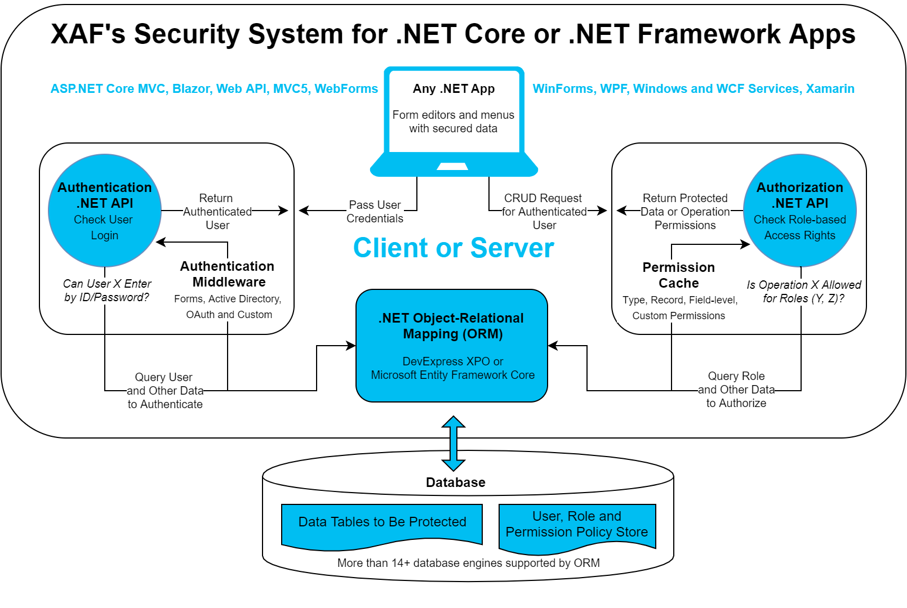

<!-- default badges list -->

<!-- default badges end -->
<!-- default file list -->

# .NET User Authentication and Group Authorization API for DevExpress XPO and Microsoft Entity Framework Core ORMs

## Demos and Step-By-Step Tutorials for .NET Framework and .NET Core
Please research the information below, because additional prerequisites may apply to certain platforms. If you cannot compile or run any of these demo apps or have questions about our tutorials or supported functionality, please submit questions in the [Support Center](https://www.devexpress.com/ask) or [the Issues tab above](https://github.com/DevExpress-Examples/XAF_how-to-use-the-integrated-mode-of-the-security-system-in-non-xaf-applications-e4908/issues) - we will be more than happy to help you.

#### DevExpress XPO
 - [DevExtreme + ASP.NET Web API OData App](/ASP.NetCore/DevExtreme.OData)
 - [WinForms App](/WinForms)
 - [ASP.NET WebForms App](/ASP.NET/WebForms)
 - [ASP.NET Core MVC App](/ASP.NetCore/MVC)
 - [Blazor Server App](/ASP.NetCore/Blazor.ServerSide)
 - [Console App](/Console)

#### Coming Next
Other Apps with EF Core and Xamarin, Blazor WebAssembly, WPF with XPO. To help us prioritize our future development, please tell us about the platforms and use-case scenarios you are most interested in using this **[short survey](https://www.devexpress.com/go/XAF_Security_NonXAF_Survey.aspx)**.

## Prerequisites
- [Visual Studio 2017 or 2019 v16.4+ (for .NET Core 3.1 examples)](https://visualstudio.microsoft.com/vs/) with the following workloads:
  - *.NET desktop development*  |  *ASP.NET and web development*  |  *.NET Core cross-platform development*
- [Download and run two unified installers for .NET Framework and .NET Core 3.1 Desktop Development](https://www.devexpress.com/Products/Try/)
  - *We recommend that you select all products when you run the DevExpress installer. It will register local NuGet package sources and item / project templates required for these tutorials. You can uninstall unnecessary components later.*
- Before you run any demo apps, run (F5) the *XafSolution.Win* or *XafSolution.Win.NetCore* app depending on your target framework and log in under 'User' or 'Admin' with an empty password.
  - *This [Database Generation and Permision Management App](./XafSolution/) will create initial users, roles, permissions and other data in the database.*

## Frequently Asked Questions

Please review [this KB Article](https://supportcenter.devexpress.com/ticket/details/t886740/faq-xaf-user-authentication-and-group-authorization-api-for-devexpress-xpo-and-microsoft). Feel free to submit additional questions in the [Support Center](https://www.devexpress.com/ask) or [the Issues tab above](https://github.com/DevExpress-Examples/XAF_how-to-use-the-integrated-mode-of-the-security-system-in-non-xaf-applications-e4908/issues) - we will be more than happy to help you.

## Target Audience & Common Usage Scenarios

- XAF developers who create non-XAF .NET apps and want to reuse existing data models and [Security System](https://docs.devexpress.com/eXpressAppFramework/113366/concepts/security-system/security-system-overview) settings (users, roles and permissions) stored in an XAF application database. Based on experience, XAF customers create custom Web and mobile UI clients with ASP.NET MVC, DevExtreme; backend servers with ASP.NET Web API/OData or Console, Windows Service, WCF apps for various administrative tasks (data modifications, report generation, scheduled workflows).

- Non-XAF developers who create standard line-of-business (LOB) apps with login, logout forms and security related functionality for any .NET UI technologies like WinForms, WPF, ASP.NET (WebForms, MVC 5, MVC Core, Razor Pages) and .NET server technologies like ASP.NET Web API/OData, WCF, etc. Yet more use-cases with Blazor & Xamarin.Forms (Android, iOS, UWP) UI technologies come with XAF v19.2 and .NET Standard 2.0 support.

## User Authentication & Group Authorization - App Security Made Easy

- Getting security right (safe, fast, up-to-date, flexible, and database agnostic) is complicated. Pre-built middleware libraries like ASP.NET Core Identity or Identity Server can be difficult to configure or offer unnecessary functionality. Our User Authentication & Group Authorization API for .NET allows you to integrate a proven, database agnostic security sub-system in the shortest possible time.

- LOB app developers want to save time and do not want to implement complex security memberships and authentication/authorization algorithms from scratch (for instance, apps that can filter protected data against a user's access rights or check whether the current user is allowed to delete records). Our User Authentication & Group Authorization API for .NET allows you to incorporate advanced security-related capabilities with minimal effort.

- While certain platforms like ASP.NET simplify authentication and basic authorization with a built-in design time APIs, it is difficult to build a flexible and customizable security system (allowing users to customize the system once the app is deployed). Our User Authentication & Group Authorization API for .NET allows you to incorporate a highly flexible/customizable security system in your next .NET app.

## Feature Overview

The primary XAF security system features used in line-of-business applications across supported platforms include:

**1\. Role-based access control with multi-database permission storage.**

**1.1.** Access control permissions linked to roles and users that can be stored in more than a dozen popular data stores powered by the XPO and EF Core ORMs (including popular RDBMS like SQL Server, Oracle, PostgreSQL, MySql, Firebird, XML and "in-memory" stores).

- [Type Permissions](https://docs.devexpress.com/eXpressAppFramework/113366/concepts/security-system/security-system-overview#type-permissions) grant Read, Write, Create, and Delete access to all objects that belong to a particular type.
- [Object Permissions](https://docs.devexpress.com/eXpressAppFramework/113366/concepts/security-system/security-system-overview#object-permissions) work in conjunction with Type Permissions and grant access to object instances that fit a specified criterion.
- [Member Permissions](https://docs.devexpress.com/eXpressAppFramework/113366/concepts/security-system/security-system-overview#member-permissions) grant access to specific members unconditionally or based on a criterion.

**1.2.** Powerful and [easy-to-use APIs](https://docs.devexpress.com/eXpressAppFramework/119065/concepts/security-system/predefined-users,-roles-and-permissions#set-permissions-for-non-administrative-roles) to configure users, roles and permissions in code or visually in XAF apps.

**1.3.** Support for extensions or replacement with [fully custom](https://docs.devexpress.com/eXpressAppFramework/113384/task-based-help/security/how-to-implement-custom-security-objects-users,-roles,-operation-permissions) user, role, and permission objects to meet the needs of your business domain or address various integration scenarios.

**2\. Authentication.**

**2.1.** Built-in [authentication types](https://docs.devexpress.com/eXpressAppFramework/119064/concepts/security-system/authentication): Forms (with username/password), Active Directory (Windows user) and Mixed (for mixing several authentication providers).

**2.2.** A modern and secure algorithm for [password generation](https://docs.devexpress.com/eXpressAppFramework/112649/concepts/security-system/passwords-in-the-security-system) and validation.

**2.3.** Support for extension or replacement with [custom authentication strategies](https://docs.devexpress.com/eXpressAppFramework/119064/concepts/security-system/authentication#custom-authentication) and logon parameters. For instance, our [popular example](https://www.devexpress.com/Support/Center/Example/Details/T535280/how-to-use-google-facebook-and-microsoft-accounts-in-asp-net-xaf-applications-oauth2-demo) shows how to use OAuth2 with Google, Facebook or Microsoft authentication providers.

**3\. Authorization.**

**3.1\.** Just two code lines to read secure records filtered against a logged user (role and permission based). When you set up a [secured Object Space provider](https://docs.devexpress.com/eXpressAppFramework/113437/Task-Based-Help/Security/How-to-Change-the-Client-Side-Security-Mode-from-UI-Level-to-Integrated-in-XPO-applications), you can create an unlimited number of secure data contexts - your data query and modification APIs will remain unchanged. A bit more code is required to connect a non-XAF client to the [Middle-Tier](https://docs.devexpress.com/eXpressAppFramework/113559/task-based-help/security/how-to-connect-to-the-wcf-application-server-from-non-xaf-applications#establish-a-connection) application server (XPO only).

**3.2.** Fine-grain access control for base and inherited objects, one to many and many to many object [relationships](https://docs.devexpress.com/eXpressAppFramework/116170/concepts/security-system/permissions-for-associated-objects), individual columns with or without criteria (example: can read the Full Name field, but cannot see and modify Salary) and specific object instances only.

**3.3.** Straightforward APIs to [check CRUD](https://docs.devexpress.com/eXpressAppFramework/112769/getting-started/comprehensive-tutorial/security-system/access-the-security-system-in-code) or custom access rights for UI element customizations. With this, you can hide or mask protected grid columns, editors in detail forms, and disable menu toolbar commands like New, Delete, Edit, etc.

**3.4.** Security permission [caching](https://docs.devexpress.com/eXpressAppFramework/115638/Concepts/Security-System/Security-Permissions-Caching) for the best possible performance. Two built-in [Permission Policies](https://docs.devexpress.com/eXpressAppFramework/116172/concepts/security-system/permission-policies) determine the security system’s behavior when explicitly specified permissions for a specific type, object, or member do not exist.

**3.5.** Proven in production environments. DevExpress Support, comprehensive documentation, examples and a [diagnostic tool](https://www.devexpress.com/Support/Center/Question/Details/T589182) are at your service to troubleshoot complex security permission configurations.
